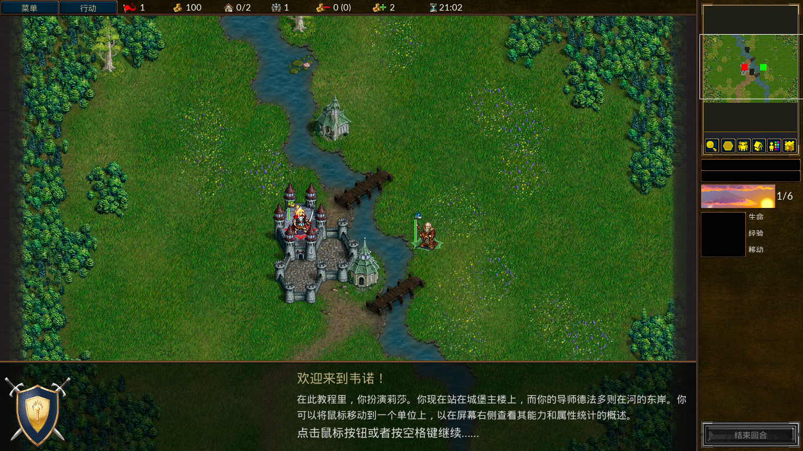

## ArchLinux仓库的游戏

不分官方和aur系列,你可以试试pacman或者aur工具,优先试试pacman工具能不能下载

#### 中文游戏

##### 2048

益智 - 休闲:2048之后还有什么?是4096?还是?

https://wiki.gnome.org/Apps/2048|| [gnome-2048](https://www.archlinux.org/packages/extra/x86_64/gnome-2048/)

https://github.com/mevdschee/2048.c || [2048.c-git](https://aur.archlinux.org/packages/2048.c-git/)AUR

##### Aisleriot	纸牌游戏集合

益智 - 休闲 - 纸牌:Aisleriot也称为Solitaire或sol,看看空当接龙玩法就知道了。

https://wiki.gnome.org/Apps/Aisleriot || [aisleriot](https://www.archlinux.org/packages/extra/x86_64/aisleriot/)

##### Atomix	分子智力游戏

原子和分子的智力游戏。

https://wiki.gnome.org/Apps/Atomix || [atomix](https://www.archlinux.org/packages/extra/x86_64/atomix/)

##### Bovo	五子棋

五子连珠，一定胜负。

https://kde.org/applications/games/bovo/ || [bovo](https://www.archlinux.org/packages/extra/x86_64/bovo/)

##### Bomber 	投弹者

街机上的投弹游戏

https://www.kde.org/applications/games/bomber/ || [bomber](https://www.archlinux.org/packages/extra/x86_64/bomber/)

##### ccGo	围棋

规则简单，下子复杂。

http://ccdw.org/~cjj/prog/ccgo/ || [ccgo](https://www.archlinux.org/packages/community/x86_64/ccgo/)

##### Cataclysm: Dark Days Ahead	大灾变(CDDA)

独立 - 生存 - 地牢 - 随机地图:这是一个生化危机版生存游戏。

http://en.cataclysmdda.com/ || [cataclysm-dda](https://www.archlinux.org/packages/community/x86_64/cataclysm-dda/) || [cataclysm-dda-ncurses](https://aur.archlinux.org/packages/cataclysm-dda-ncurses/)AUR || [cataclysm-dda-tiles](https://aur.archlinux.org/packages/cataclysm-dda-tiles/)AUR

##### DDNet

多用户 - 快节奏:Teeworlds的修改版,快节奏横向卷轴多人动作射击游戏。

https://ddnet.tw/ || [ddnet](https://aur.archlinux.org/packages/ddnet/)AUR

##### Five or more	连珠消球

将彩球连成一线以消除

https://wiki.gnome.org/Apps/Five%20or%20more || [five-or-more](https://www.archlinux.org/packages/extra/x86_64/five-or-more/)

##### Freeciv

多用户 - 回合制 - 策略游戏:灵感来自Microprose文明帝国。

http://freeciv.wikia.com/wiki/Main_Page || [freeciv](https://www.archlinux.org/packages/extra/x86_64/freeciv/)

##### FreeCol	

多用户 - 回合制 - 策略游戏:基于殖民化的基于回合的策略游戏。

http://www.freecol.org/ || [freecol](https://www.archlinux.org/packages/community/any/freecol/)

##### Four in a Row	四子连线

将四粒棋子排成一线以取胜

https://wiki.gnome.org/Apps/Four-in-a-row || [four-in-a-row](https://www.archlinux.org/packages/extra/x86_64/four-in-a-row/)

##### Gbrainy	脑筋急转弯

玩那些可以挑战您的逻辑、语言能力、计算和记忆的游戏

https://wiki.gnome.org/Apps/gbrainy || [gbrainy](https://www.archlinux.org/packages/community/any/gbrainy/)

##### Chess 国际象棋

2D国际象棋游戏

https://wiki.gnome.org/Apps/Chess || [gnome-chess](https://www.archlinux.org/packages/extra/x86_64/gnome-chess/)

##### Hitori	错误的数独

类似错的数独游戏开局，要求清除多余冲突数字

https://wiki.gnome.org/Apps/Hitori || [hitori](https://www.archlinux.org/packages/extra/x86_64/hitori/)

##### Lights Off	关灯

Lights Off是一款益智游戏，其目标是关闭棋盘上的所有棋子。每次单击都会切换单击的图块及其非对角线邻居的状态。

https://wiki.gnome.org/Apps/Lightsoff || [lightsoff](https://www.archlinux.org/packages/extra/x86_64/lightsoff/)

##### Lagno	黑白棋

Iagno是一款类似于Go的双人战略游戏。

https://wiki.gnome.org/Apps/Iagno || [Iagno](https://www.archlinux.org/packages/extra/x86_64/iagno/)

##### Klotski	华容道

益智 - 休闲:前前后后左右皆是追兵,曹操走得了吗?灵感来自曹操退走华容道。

https://wiki.gnome.org/Apps/Klotski || [gnome-klotski](https://www.archlinux.org/packages/extra/x86_64/gnome-klotski/)

##### kshisen	连连看

类似连连看的麻将游戏

https://kde.org/applications/games/kshisen/ || [kshisen](https://www.archlinux.org/packages/extra/x86_64/kshisen/)

##### Mahjongg	麻将对对碰

经典东方瓷砖游戏Mahjongg的单人纸牌（单人游戏）版本。目标是选择相似的瓷砖对。

https://wiki.gnome.org/Apps/Mahjongg || [gnome-mahjongg](https://www.archlinux.org/packages/extra/x86_64/gnome-mahjongg/)

##### Mines	扫雷

扫除雷区里的隐藏的地雷

https://kde.org/applications/games/kmines/ || [kmines](https://www.archlinux.org/packages/extra/x86_64/kmines/)

##### Quadrapassel	俄罗斯方块

益智 - 休闲:将下落的方块组合在一起。

https://wiki.gnome.org/Apps/Quadrapassel || [quadrapassel](https://www.archlinux.org/packages/extra/x86_64/quadrapassel/)

##### Robots	机器人

经典的机器人游戏，你必须避免一堆试图杀死你的机器人。你采取的每一步都会让他们更接近你。幸运的是，他们不是很聪明，你也有一个有用的远程传送小工具。

https://wiki.gnome.org/Apps/Robots || [gnome-robots](https://www.archlinux.org/packages/extra/x86_64/gnome-robots/)

##### sudoku	数独

通过这个数字格子解谜游戏测试您的逻辑能力

https://wiki.gnome.org/Apps/Sudoku || [gnome-sudoku](https://www.archlinux.org/packages/extra/x86_64/gnome-sudoku/)

##### Swell Foop	消色块

尽可能少地移动对象。彼此相邻的类似对象作为一组被移除。

https://wiki.gnome.org/Apps/Swell%20Foop || [swell-foop](https://www.archlinux.org/packages/extra/x86_64/swell-foop/)

##### Tali	掷骰子

一种类似扑克的的骰子游戏

https://wiki.gnome.org/Apps/Tali || [tall](https://www.archlinux.org/packages/extra/x86_64/tali/)

##### Taquin	推盘

将方块滑动到正确位置

https://wiki.gnome.org/Apps/Taquin || [gnome-taquin](https://www.archlinux.org/packages/extra/x86_64/gnome-taquin/)

##### Tetravex	四邻

匹配编号的方块来完成谜题

https://wiki.gnome.org/Apps/Tetravex || [gnome-tetravex](https://www.archlinux.org/packages/extra/x86_64/gnome-tetravex/)

##### The Battle for Wesnoth	韦诺之战

多用户 - 回合制 - 策略游戏:免费的基于回合的战术策略游戏，具有高度的幻想主题，包括单人游戏和在线/多人游戏多人战斗。

https://www.wesnoth.org/ || [wesnoth](https://www.archlinux.org/packages/community/x86_64/wesnoth/)

##### Nibbles	贪吃蛇

休闲 - 多人: 小蛇游走于迷宫

https://wiki.gnome.org/Apps/Nibbles || [gnome-nibbles](https://www.archlinux.org/packages/extra/x86_64/gnome-nibbles/)

##### 测试，下面有空再修正

#### 英文游戏

##### 0ad

多用户 - 回合制 - 策略游戏:类似于《帝国时代》的策略类3D游戏,需要自己下载中文语言包。有没有发现和魔兽争霸差不多？

http://play0ad.com/ || [0ad](https://www.archlinux.org/packages/community/x86_64/0ad/)

##### Abuse

横版射击 - 角色 - 多人联机:侧滚动动作游戏，让你对抗无情的外星杀手。

http://abuse.zoy.org/ || [abuse](https://www.archlinux.org/packages/community/x86_64/abuse/)

##### Angband

*Angband*是一款免费的单人地下城探险游戏，您可以扮演冒险家的角色，探索深层地牢，与怪物战斗，并获得最佳武器，为与黑暗之王Morgoth的最后一场战斗做准备。这个游戏你需要进入Ctrl+Alt+F2,再来命令angband。解决中文字体冲突问题。

##### Block Attack!

##### BomberClone	炸弹人

##### Dungeon Crawl Stone Soup

##### Dwarf Fortress

独立 - 生存 - 地牢 - 随机地图:单人游戏幻想游戏。你在随机生成的持久世界中控制矮人前哨或冒险家。

http://www.bay12games.com/dwarves/ || [dwarffortress](https://www.archlinux.org/packages/community/x86_64/dwarffortress/)

##### NetHack

独立 - 生存 - 地牢 - 随机地图:30多年文字游戏,不知道是不是网游?(纯英文)

http://www.nethack.org/index.html || [nethack](https://www.archlinux.org/packages/community/x86_64/nethack/)

​	zaz - 泡泡龙版祖玛
	dwarffortress - 单人游戏幻想游戏。你在随机生成的持久世界中控制矮人前哨或冒险家。
	minetest - 我的世界

#### 未知语言游戏

counter-strike-2d - 反恐精英2D版 - 目前装不上,steam也运行不了

## steam游戏平台

没有说明都是中文游戏,有的游戏需要MOD来中文化.

Terraria - 泰拉瑞亚
Don't - Starve - 饥荒单机
Don't - Starve - Together - 饥荒联机版
Oxygen - Not - Included - 缺氧
Dungeon - Warfare - 地牢塔防
Age - of - Conquest - IV - 征服世纪4

## Wine平台游戏

霸王的梦想
植物大战僵尸 - (什么中文版,年度版)

## Android平台游戏

没想好,毕竟大部分游戏适合触屏,不知道什么游戏才叫好游戏

## MAME平台游戏

kof - 拳皇系列
kov - 三国战绩系列
Metal - Slug - 合金弹头系列
西游记系列
恐龙快打二代
铁钩船长
达人王2

