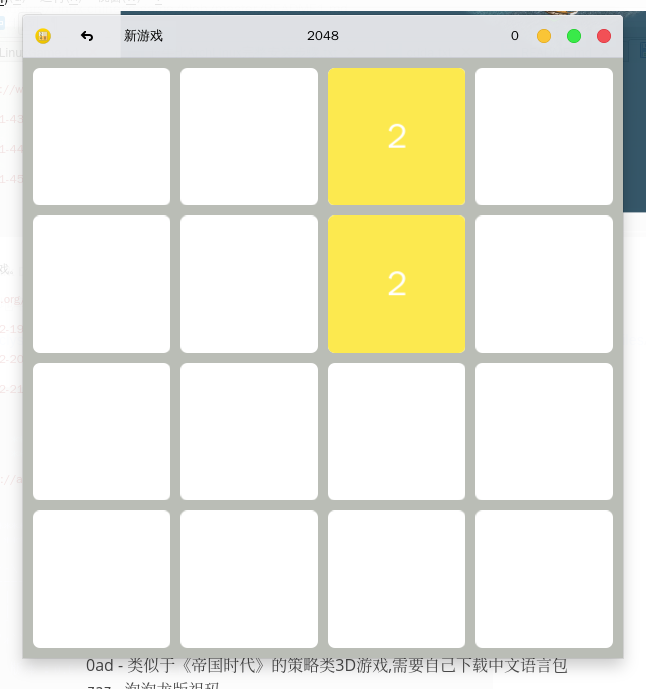

[无图画版](README.md)

# Linux-chinese-game

说明:这里是Linux中文游戏列表,测试运行环境ArchLinux.

ArchLinux官方英文WiKi推荐游戏[直达连接](https://wiki.archlinux.org/index.php/List_of_games)或者中文WiKi推荐游戏[直达链接](https://wiki.archlinux.org/index.php/List_of_games_(%E7%AE%80%E4%BD%93%E4%B8%AD%E6%96%87) -  - )

(这里不分中英文,英文版WiKi内容永远比中文版更新,更好,推荐优先使用英文WiKi)

## ArchLinux仓库的游戏

不分官方和aur系列,你可以试试pacman或者aur工具,优先试试pacman工具能不能下载

#### 中文游戏

##### 2048	

益智 - 休闲:2048之后还有什么?是4096?还是?

https://github.com/mevdschee/2048.c || [2048.c-git](https://aur.archlinux.org/packages/2048.c-git/)AUR

##### Cataclysm: Dark Days Ahead	大灾变(CDDA)

独立 - 生存 - 地牢 - 随机地图:这是一个生化危机版生存游戏。

<http://en.cataclysmdda.com/> || [cataclysm-dda](https://www.archlinux.org/packages/community/x86_64/cataclysm-dda/) || [cataclysm-dda-ncurses](https://aur.archlinux.org/packages/cataclysm-dda-ncurses/)AUR || [cataclysm-dda-tiles](https://aur.archlinux.org/packages/cataclysm-dda-tiles/)AUR

##### DDNet	

多用户 - 快节奏:Teeworlds的修改版,快节奏横向卷轴多人动作射击游戏。

<https://ddnet.tw/> || [ddnet](https://aur.archlinux.org/packages/ddnet/)AUR

##### Freeciv

多用户 - 回合制 - 策略游戏:灵感来自Microprose文明帝国。

<http://freeciv.wikia.com/wiki/Main_Page> || [freeciv](https://www.archlinux.org/packages/extra/x86_64/freeciv/)

##### FreeCol	

多用户 - 回合制 - 策略游戏:基于殖民化的基于回合的策略游戏。

<http://www.freecol.org/> || [freecol](https://www.archlinux.org/packages/community/any/freecol/)

##### The Battle for Wesnoth	韦诺之战 

多用户 - 回合制 - 策略游戏:免费的基于回合的战术策略游戏，具有高度的幻想主题，包括单人游戏和在线/多人游戏多人战斗。

<https://www.wesnoth.org/> || [wesnoth](https://www.archlinux.org/packages/community/x86_64/wesnoth/)

#### 英文游戏

 

0ad - 类似于《帝国时代》的策略类3D游戏,需要自己下载中文语言包
	zaz - 泡泡龙版祖玛
	nethack - 30多年文字游戏,不知道是不是网游?(纯英文)
	dwarffortress - 单人游戏幻想游戏。你在随机生成的持久世界中控制矮人前哨或冒险家。
	minetest - 我的世界

#### 未知语言游戏

counter-strike-2d - 反恐精英2D版 - 目前装不上,steam也运行不了

## steam游戏平台

没有说明都是中文游戏,有的游戏需要MOD来中文化.

Terraria - 泰拉瑞亚
Don't - Starve - 饥荒单机
Don't - Starve - Together - 饥荒联机版
Oxygen - Not - Included - 缺氧
Dungeon - Warfare - 地牢塔防
Age - of - Conquest - IV - 征服世纪4

## Wine平台游戏

霸王的梦想
植物大战僵尸 - (什么中文版,年度版)

## Android平台游戏

没想好,毕竟大部分游戏适合触屏,不知道什么游戏才叫好游戏

## MAME平台游戏

kof - 拳皇系列
kov - 三国战绩系列
Metal - Slug - 合金弹头系列
西游记系列
恐龙快打二代
铁钩船长
达人王2

