-   [ArchLinux仓库的游戏](#archlinux仓库的游戏)
    -   [中文游戏](#中文游戏)
        -   [2048](#section)
        -   [Aisleriot 纸牌游戏集合](#aisleriot-纸牌游戏集合)
        -   [Atomix 分子智力游戏](#atomix-分子智力游戏)
        -   [Bovo 五子棋](#bovo-五子棋)
        -   [Bomber 投弹者](#bomber-投弹者)
        -   [ccGo 围棋](#ccgo-围棋)
        -   [Cataclysm: Dark Days Ahead
            大灾变(CDDA)](#cataclysm-dark-days-ahead-大灾变cdda)
        -   [Chess 国际象棋](#chess-国际象棋)
        -   [DDNet](#ddnet)
        -   [Five or more 连珠消球](#five-or-more-连珠消球)
        -   [Freeciv](#freeciv)
        -   [FreeCol](#freecol)
        -   [Four in a Row 四子连线](#four-in-a-row-四子连线)
        -   [Gbrainy 脑筋急转弯](#gbrainy-脑筋急转弯)
        -   [Hitori 错误的数独](#hitori-错误的数独)
        -   [Kajongg 麻将](#kajongg-麻将)
        -   [Klotski 华容道](#klotski-华容道)
        -   [Kapman 吃豆人](#kapman-吃豆人)
        -   [KAtomic 推箱子](#katomic-推箱子)
        -   [KBlackBox 黑箱逻辑游戏](#kblackbox-黑箱逻辑游戏)
        -   [KBlocks 俄罗斯方块](#kblocks-俄罗斯方块)
        -   [KBounce 弹球游戏](#kbounce-弹球游戏)
        -   [KBreakOut 挡板弹球游戏](#kbreakout-挡板弹球游戏)
        -   [Kcheckers 国际象棋](#kcheckers-国际象棋)
        -   [KDiamond 三子连线棋游戏](#kdiamond-三子连线棋游戏)
        -   [KFourInLine 四子连珠游戏](#kfourinline-四子连珠游戏)
        -   [KGoldrunner
            淘金，避敌，以及解谜](#kgoldrunner-淘金避敌以及解谜)
        -   [KHangMan 吊颈人游戏](#khangman-吊颈人游戏)
        -   [Kigo 围棋](#kigo-围棋)
        -   [Killbots 机器人策略游戏](#killbots-机器人策略游戏)
        -   [Kiriki 快艇骰子](#kiriki-快艇骰子)
        -   [KJumpingCube 占领版块](#kjumpingcube-占领版块)
        -   [Klickety 消除色块游戏](#klickety-消除色块游戏)
        -   [KMahjongg 麻将连连看](#kmahjongg-麻将连连看)
        -   [KMines 扫雷](#kmines-扫雷)
        -   [kNetwalk 网络建设游戏](#knetwalk-网络建设游戏)
        -   [Knights 国际象棋](#knights-国际象棋)
        -   [Kolf](#kolf)
        -   [Kollision](#kollision)
        -   [Kolor Lines](#kolor-lines)
        -   [Konquest](#konquest)
        -   [KPatience 单人纸牌游戏](#kpatience-单人纸牌游戏)
        -   [KReversi](#kreversi)
        -   [KsirK](#ksirk)
        -   [KSnakeDuel 超空间竞速](#ksnakeduel-超空间竞速)
        -   [KSpaceDuel 空间型街机游戏](#kspaceduel-空间型街机游戏)
        -   [KSquares](#ksquares)
        -   [KSudoku 多种类数独](#ksudoku-多种类数独)
        -   [Kubrick 魔方](#kubrick-魔方)
        -   [kshisen 连连看](#kshisen-连连看)
        -   [Lagno 黑白棋](#lagno-黑白棋)
        -   [Lights Off 关灯](#lights-off-关灯)
        -   [Mahjongg 麻将对对碰](#mahjongg-麻将对对碰)
        -   [MegaGlest](#megaglest)
        -   [Mines 扫雷](#mines-扫雷)
        -   [Pingus](#pingus)
        -   [Quadrapassel 俄罗斯方块](#quadrapassel-俄罗斯方块)
        -   [Robots 机器人](#robots-机器人)
        -   [sudoku 数独](#sudoku-数独)
        -   [Swell Foop 消色块](#swell-foop-消色块)
        -   [Tali 掷骰子](#tali-掷骰子)
        -   [Taquin 推盘](#taquin-推盘)
        -   [Tetravex 四邻](#tetravex-四邻)
        -   [The Battle for Wesnoth
            韦诺之战](#the-battle-for-wesnoth-韦诺之战)
        -   [Nibbles 贪吃蛇](#nibbles-贪吃蛇)
-   [测试分割线，下面有空再修正](#测试分割线下面有空再修正)
-   [测试分割线，下面有空再修正](#测试分割线下面有空再修正-1)
    -   [英文游戏](#英文游戏)
        -   [0ad](#ad)
        -   [Abuse](#abuse)
        -   [Angband](#angband)
        -   [Block Attack!](#block-attack)
        -   [BomberClone 炸弹人](#bomberclone-炸弹人)
        -   [Dungeon Crawl Stone Soup](#dungeon-crawl-stone-soup)
        -   [Dwarf Fortress](#dwarf-fortress)
        -   [Gweled](#gweled)
        -   [kanagram 字母顺序游戏](#kanagram-字母顺序游戏)
        -   [NetHack](#nethack)
        -   [Shattered Pixel Dungeon](#shattered-pixel-dungeon)
        -   [Teeworlds](#teeworlds)
        -   [Warsow](#warsow)
            -   [未知语言游戏](#未知语言游戏)
    -   [steam游戏平台](#steam游戏平台)
    -   [Wine平台游戏](#wine平台游戏)
    -   [Android平台游戏](#android平台游戏)
    -   [MAME平台游戏](#mame平台游戏)

ArchLinux仓库的游戏
===================

不分官方和aur系列,你可以试试pacman或者aur工具,优先试试pacman工具能不能下载

中文游戏
--------

### 2048

益智 - 休闲:2048之后还有什么?是4096?还是?

https://wiki.gnome.org/Apps/2048\|\|
[gnome-2048](https://www.archlinux.org/packages/extra/x86_64/gnome-2048/)

https://github.com/mevdschee/2048.c \|\|
[2048.c-git](https://aur.archlinux.org/packages/2048.c-git/)AUR

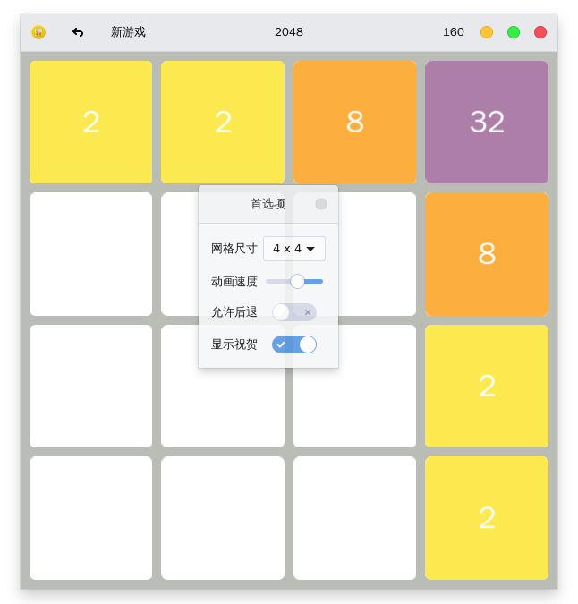

### Aisleriot 纸牌游戏集合

益智 - 休闲 -
纸牌:Aisleriot也称为Solitaire或sol,看看空当接龙玩法就知道了。

https://wiki.gnome.org/Apps/Aisleriot \|\|
[aisleriot](https://www.archlinux.org/packages/extra/x86_64/aisleriot/)

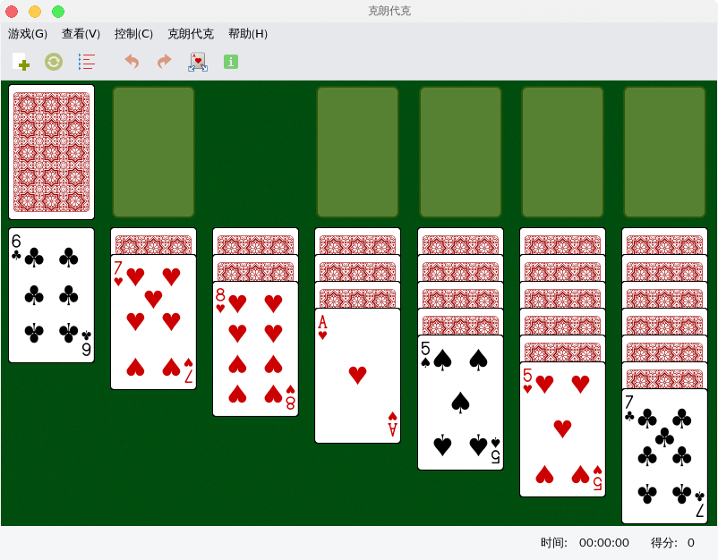

### Atomix 分子智力游戏

原子和分子的智力游戏。

https://wiki.gnome.org/Apps/Atomix \|\|
[atomix](https://www.archlinux.org/packages/extra/x86_64/atomix/)

### Bovo 五子棋

五子连珠，一定胜负。

https://kde.org/applications/games/bovo/ \|\|
[bovo](https://www.archlinux.org/packages/extra/x86_64/bovo/)

### Bomber 投弹者

街机上的投弹游戏

https://www.kde.org/applications/games/bomber/ \|\| [bomber](https://www.archlinux.org/packages/extra/x86_64/bomber/)

### ccGo 围棋

规则简单，下子复杂。

http://ccdw.org/\~cjj/prog/ccgo/ \|\|
[ccgo](https://www.archlinux.org/packages/community/x86_64/ccgo/)

### Cataclysm: Dark Days Ahead 大灾变(CDDA)

独立 - 生存 - 地牢 - 随机地图:这是一个生化危机版生存游戏。

http://en.cataclysmdda.com/ \|\|
[cataclysm-dda](https://www.archlinux.org/packages/community/x86_64/cataclysm-dda/)
\|\|
[cataclysm-dda-ncurses](https://aur.archlinux.org/packages/cataclysm-dda-ncurses/)AUR
\|\|
[cataclysm-dda-tiles](https://aur.archlinux.org/packages/cataclysm-dda-tiles/)AUR

### Chess 国际象棋

2D国际象棋游戏

https://wiki.gnome.org/Apps/Chess \|\|
[gnome-chess](https://www.archlinux.org/packages/extra/x86_64/gnome-chess/)

### DDNet

多用户 - 快节奏:Teeworlds的修改版,快节奏横向卷轴多人动作射击游戏。

https://ddnet.tw/ \|\| [ddnet](https://aur.archlinux.org/packages/ddnet/)AUR

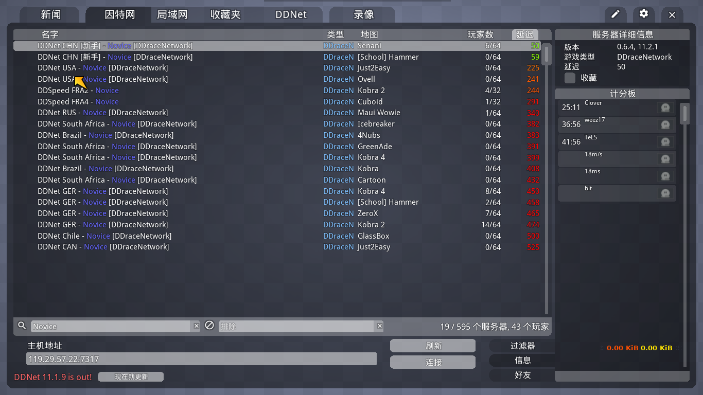

### Five or more 连珠消球

将彩球连成一线以消除

https://wiki.gnome.org/Apps/Five%20or%20more \|\|
[five-or-more](https://www.archlinux.org/packages/extra/x86_64/five-or-more/)

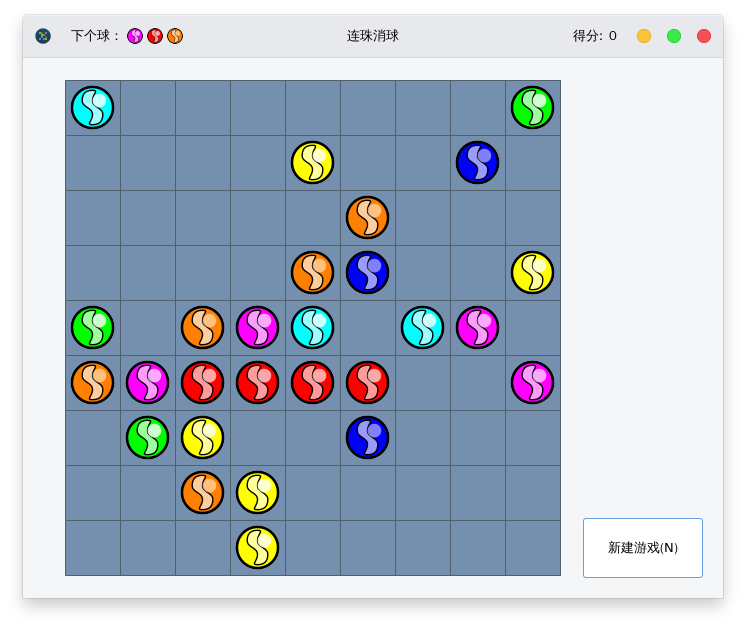

### Freeciv

多用户 - 回合制 - 策略游戏:灵感来自Microprose文明帝国。

http://freeciv.wikia.com/wiki/Main\_Page \|\|
[freeciv](https://www.archlinux.org/packages/extra/x86_64/freeciv/)

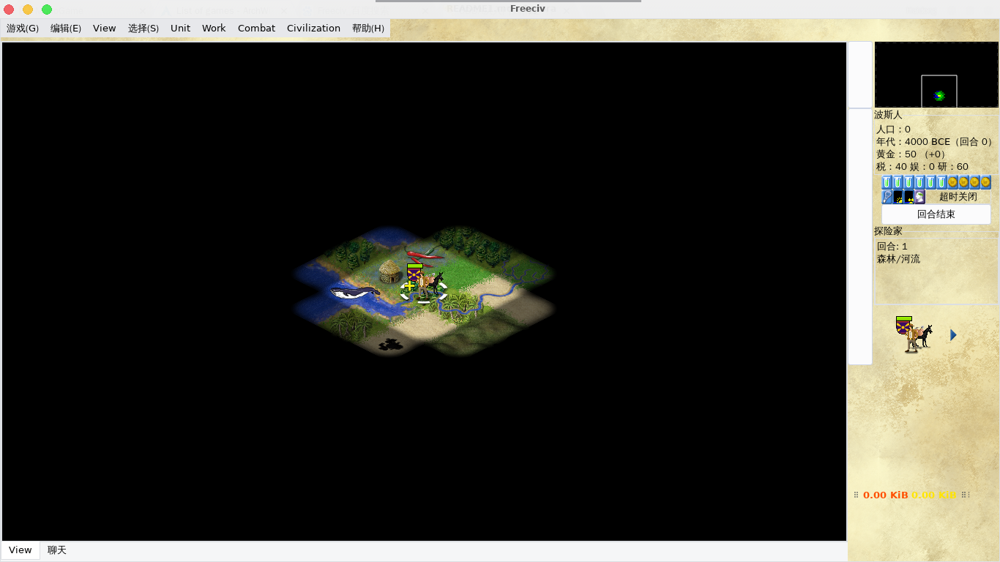

### FreeCol

多用户 - 回合制 - 策略游戏:基于殖民化的基于回合的策略游戏。

http://www.freecol.org/ \|\|
[freecol](https://www.archlinux.org/packages/community/any/freecol/)

### Four in a Row 四子连线

将四粒棋子排成一线以取胜

https://wiki.gnome.org/Apps/Four-in-a-row \|\|
[four-in-a-row](https://www.archlinux.org/packages/extra/x86_64/four-in-a-row/)

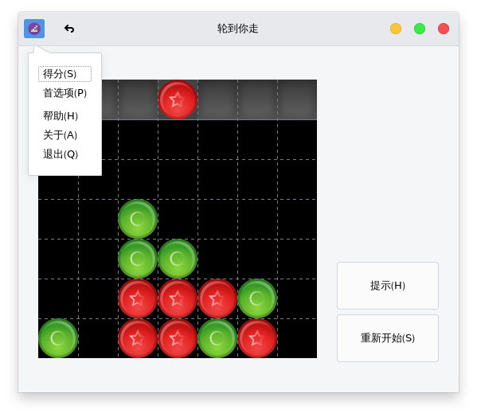

### Gbrainy 脑筋急转弯

玩那些可以挑战您的逻辑、语言能力、计算和记忆的游戏

https://wiki.gnome.org/Apps/gbrainy \|\|
[gbrainy](https://www.archlinux.org/packages/community/any/gbrainy/)

### Hitori 错误的数独

类似错的数独游戏开局，要求清除多余冲突数字

https://wiki.gnome.org/Apps/Hitori \|\|
[hitori](https://www.archlinux.org/packages/extra/x86_64/hitori/)

### Kajongg 麻将

中国传统的四人桌上游戏

### Klotski 华容道

益智 - 休闲:前前后后左右皆是追兵,曹操走得了吗?灵感来自曹操退走华容道。

https://wiki.gnome.org/Apps/Klotski \|\|
[gnome-klotski](https://www.archlinux.org/packages/extra/x86_64/gnome-klotski/)

### Kapman 吃豆人

逃脱精灵吃豆子

### KAtomic 推箱子

类似推箱子的逻辑游戏

### KBlackBox 黑箱逻辑游戏

找出所有球隐匿的位置。

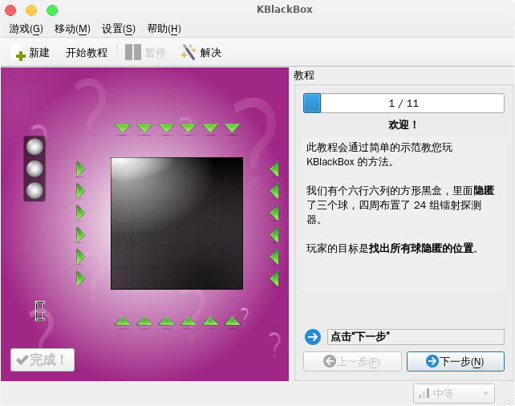

### KBlocks 俄罗斯方块

俄罗斯方块游戏

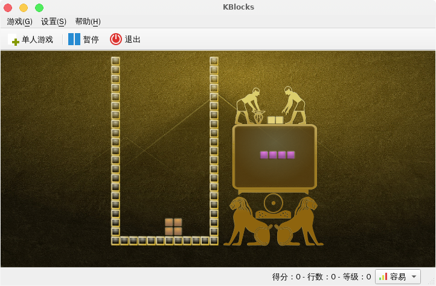

### KBounce 弹球游戏

知道街机游戏天蚕变吗？

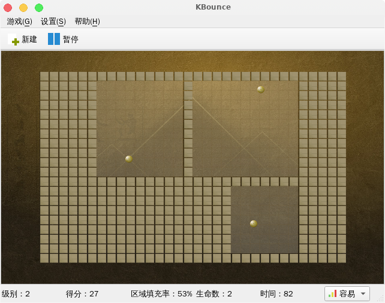

### KBreakOut 挡板弹球游戏

街机版和红白机版弹球游戏，都玩过了。

### Kcheckers 国际象棋

### KDiamond 三子连线棋游戏

三子连线棋游戏

### KFourInLine 四子连珠游戏

四子连珠游戏

### KGoldrunner 淘金，避敌，以及解谜

动作和解谜游戏

### KHangMan 吊颈人游戏

KDE 吊颈人游戏

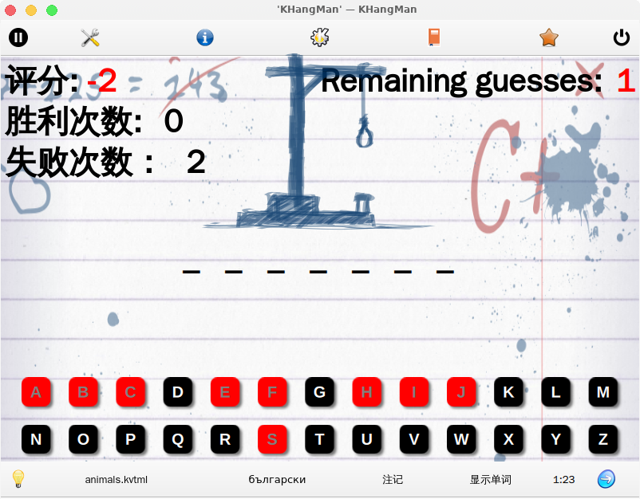

### Kigo 围棋

围棋游戏

### Killbots 机器人策略游戏

KDE 小游戏，边传送边杀掉机器人。

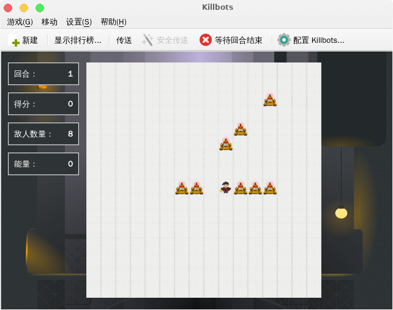

### Kiriki 快艇骰子

快艇骰子游戏

### KJumpingCube 占领版块

版块占领游戏

### Klickety 消除色块游戏

### KMahjongg 麻将连连看

麻将连连看游戏

### KMines 扫雷

扫雷游戏

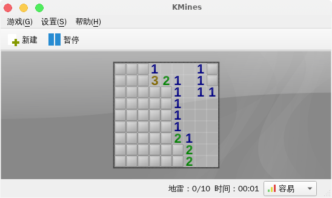

### kNetwalk 网络建设游戏

类似管道维修的游戏

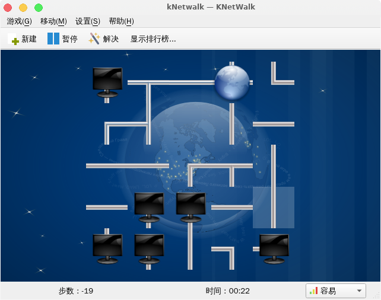

### Knights 国际象棋

国际象棋游戏

### Kolf

Miniature Golf

### Kollision

讲个笑话，是男人，坚持３０秒。

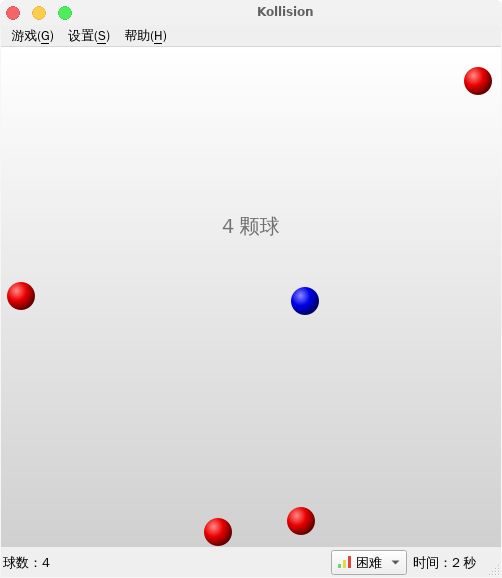

### Kolor Lines

类似连珠游戏

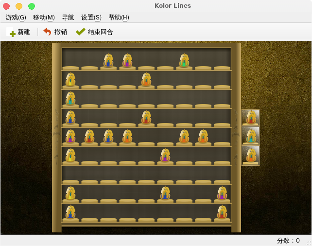

### Konquest

星际策略游戏

### KPatience 单人纸牌游戏

考验耐心的牌类游戏

### KReversi

### KsirK

World Domination Strategy Game

### KSnakeDuel 超空间竞速

### KSpaceDuel 空间型街机游戏

### KSquares

通过点连接创建方形

### KSudoku 多种类数独

多种类数独游戏

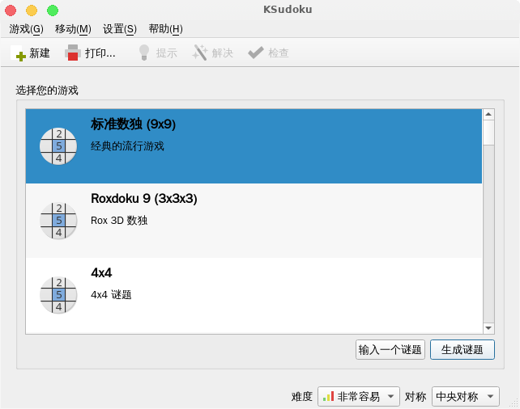

### Kubrick 魔方

不错的魔方游戏，解不了的，可以用电脑自动解决。可以载入存档。

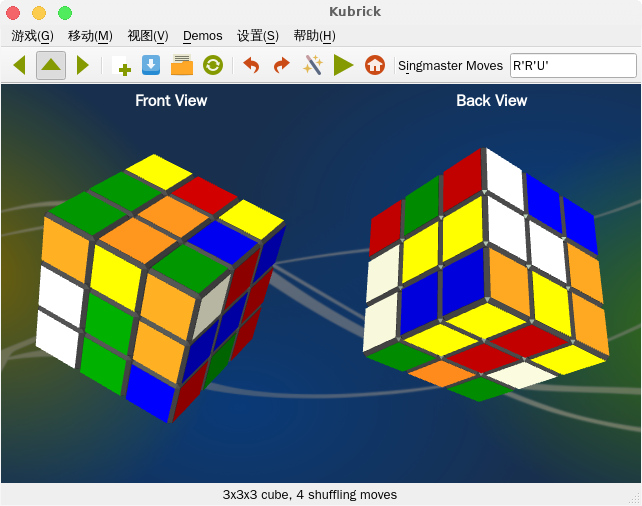

### kshisen 连连看

类似连连看的麻将游戏

https://kde.org/applications/games/kshisen/ \|\|
[kshisen](https://www.archlinux.org/packages/extra/x86_64/kshisen/)

### Lagno 黑白棋

Iagno是一款类似于Go的双人战略游戏。

https://wiki.gnome.org/Apps/Iagno \|\|
[Iagno](https://www.archlinux.org/packages/extra/x86_64/iagno/)

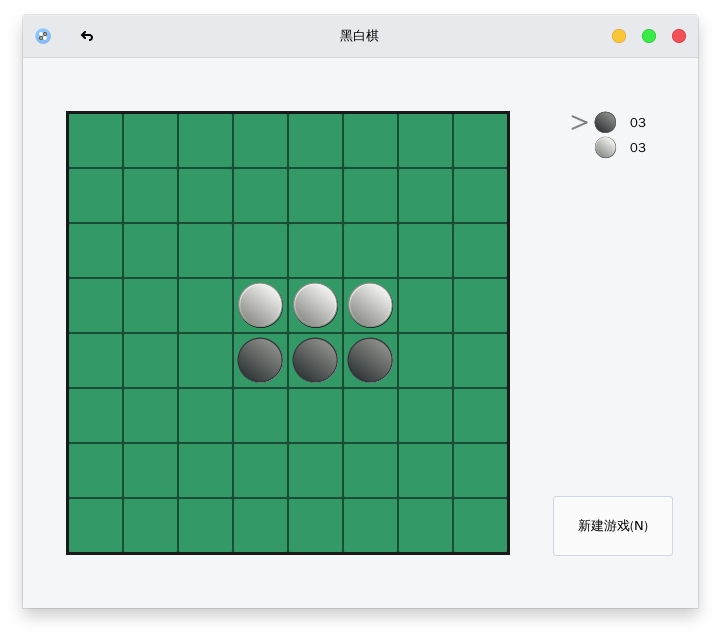

### Lights Off 关灯

Lights
Off是一款益智游戏，其目标是关闭棋盘上的所有棋子。每次单击都会切换单击的图块及其非对角线邻居的状态。

https://wiki.gnome.org/Apps/Lightsoff \|\|
[lightsoff](https://www.archlinux.org/packages/extra/x86_64/lightsoff/)

### Mahjongg 麻将对对碰

经典东方瓷砖游戏Mahjongg的单人纸牌（单人游戏）版本。目标是选择相似的瓷砖对。

https://wiki.gnome.org/Apps/Mahjongg \|\|
[gnome-mahjongg](https://www.archlinux.org/packages/extra/x86_64/gnome-mahjongg/)

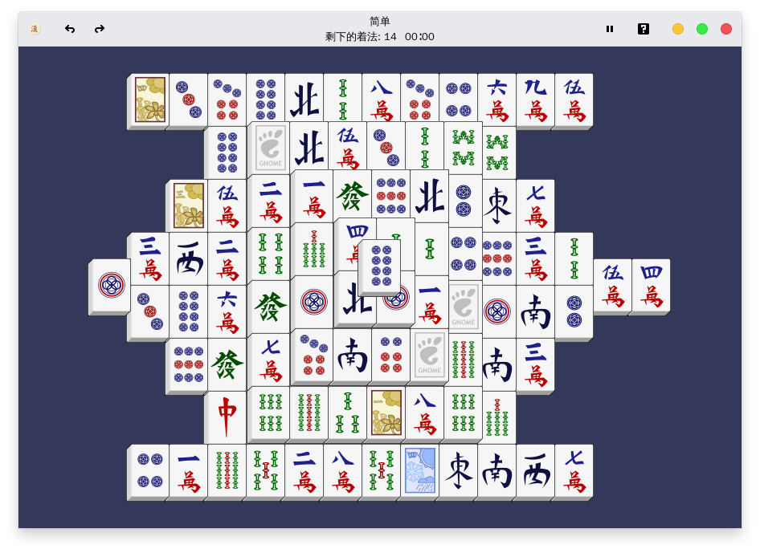

### MegaGlest

需要手动设置中文

https://megaglest.org

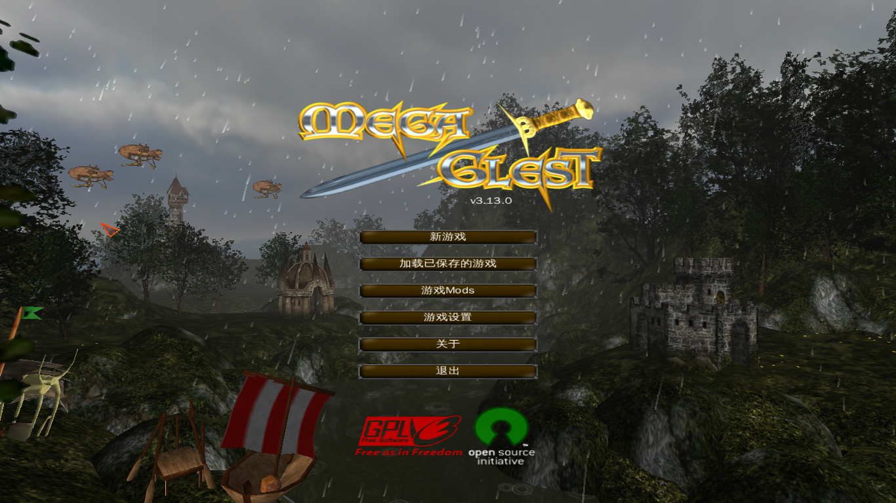

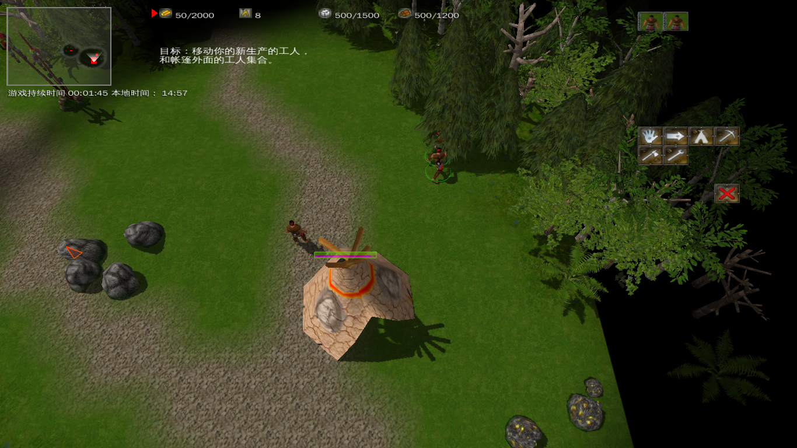

### Mines 扫雷

扫除雷区里的隐藏的地雷

https://kde.org/applications/games/kmines/ \|\|
[kmines](https://www.archlinux.org/packages/extra/x86_64/kmines/)

### Pingus

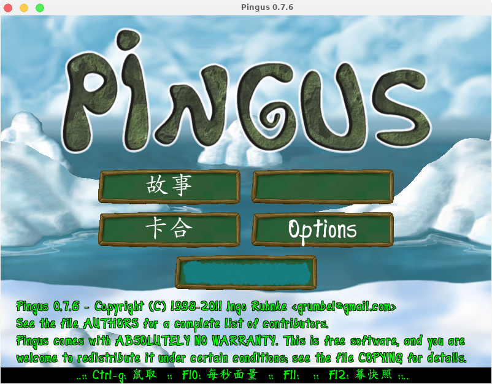

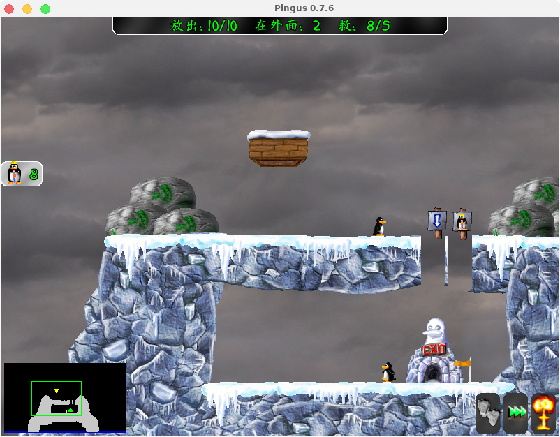

### Quadrapassel 俄罗斯方块

益智 - 休闲:将下落的方块组合在一起。

https://wiki.gnome.org/Apps/Quadrapassel \|\|
[quadrapassel](https://www.archlinux.org/packages/extra/x86_64/quadrapassel/)

### Robots 机器人

经典的机器人游戏，你必须避免一堆试图杀死你的机器人。你采取的每一步都会让他们更接近你。幸运的是，他们不是很聪明，你也有一个有用的远程传送小工具。

https://wiki.gnome.org/Apps/Robots \|\|
[gnome-robots](https://www.archlinux.org/packages/extra/x86_64/gnome-robots/)

### sudoku 数独

通过这个数字格子解谜游戏测试您的逻辑能力

https://wiki.gnome.org/Apps/Sudoku \|\|
[gnome-sudoku](https://www.archlinux.org/packages/extra/x86_64/gnome-sudoku/)

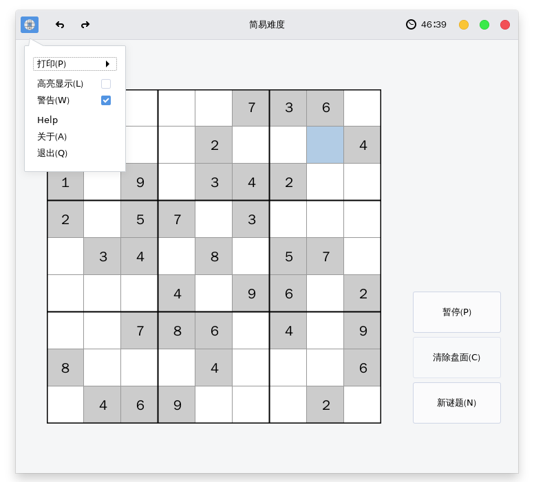

### Swell Foop 消色块

尽可能少地移动对象。彼此相邻的类似对象作为一组被移除。

https://wiki.gnome.org/Apps/Swell%20Foop \|\|
[swell-foop](https://www.archlinux.org/packages/extra/x86_64/swell-foop/)

### Tali 掷骰子

一种类似扑克的的骰子游戏

https://wiki.gnome.org/Apps/Tali \|\|
[tall](https://www.archlinux.org/packages/extra/x86_64/tali/)

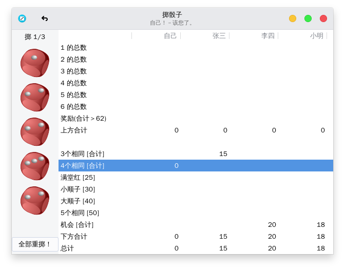

### Taquin 推盘

将方块滑动到正确位置

https://wiki.gnome.org/Apps/Taquin \|\|
[gnome-taquin](https://www.archlinux.org/packages/extra/x86_64/gnome-taquin/)

### Tetravex 四邻

匹配编号的方块来完成谜题

https://wiki.gnome.org/Apps/Tetravex \|\|
[gnome-tetravex](https://www.archlinux.org/packages/extra/x86_64/gnome-tetravex/)

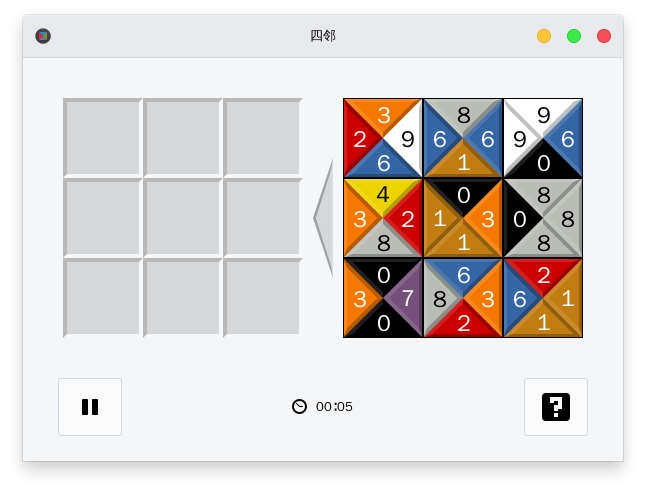

### The Battle for Wesnoth 韦诺之战

多用户 - 回合制 -
策略游戏:免费的基于回合的战术策略游戏，具有高度的幻想主题，包括单人游戏和在线/多人游戏多人战斗。

https://www.wesnoth.org/ \|\| [wesnoth](https://www.archlinux.org/packages/community/x86_64/wesnoth/)

### Nibbles 贪吃蛇

休闲 - 多人: 小蛇游走于迷宫

https://wiki.gnome.org/Apps/Nibbles \|\|
[gnome-nibbles](https://www.archlinux.org/packages/extra/x86_64/gnome-nibbles/)

测试分割线，下面有空再修正
==========================

------------------------------------------------------------------------

测试分割线，下面有空再修正
==========================

英文游戏
--------

### 0ad

多用户 - 回合制 -
策略游戏:类似于《帝国时代》的策略类3D游戏,需要自己下载中文语言包。有没有发现和魔兽争霸差不多？

http://play0ad.com/ \|\|
[0ad](https://www.archlinux.org/packages/community/x86_64/0ad/)

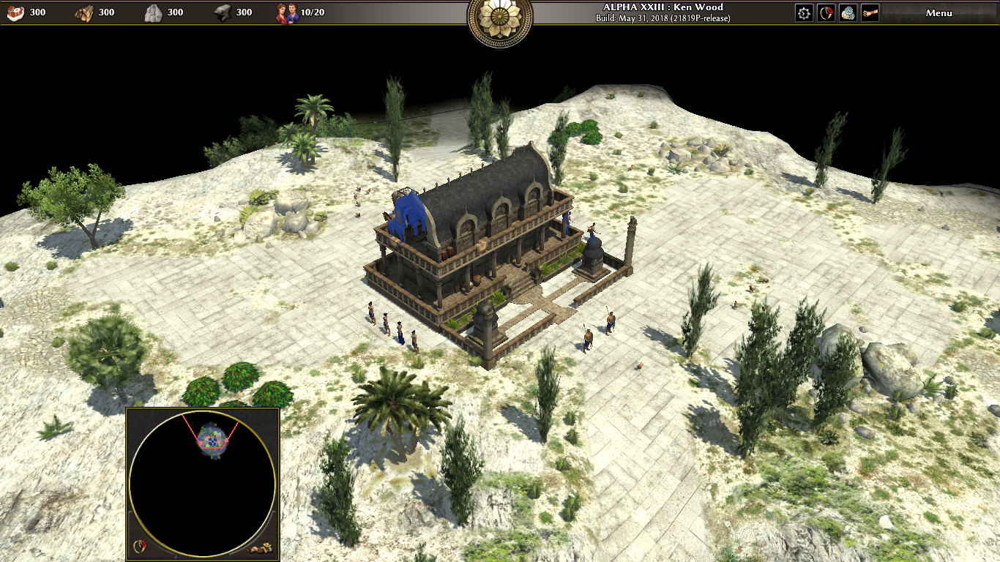

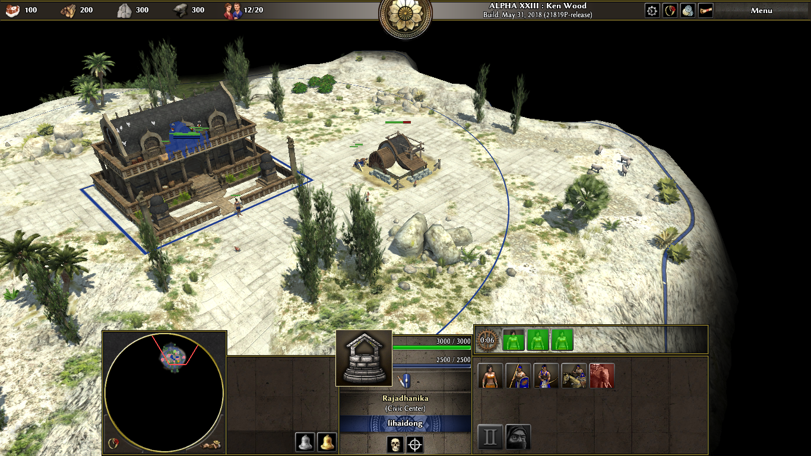

### Abuse

横版射击 - 角色 - 多人联机:侧滚动动作游戏，让你对抗无情的外星杀手。

http://abuse.zoy.org/ \|\|
[abuse](https://www.archlinux.org/packages/community/x86_64/abuse/)

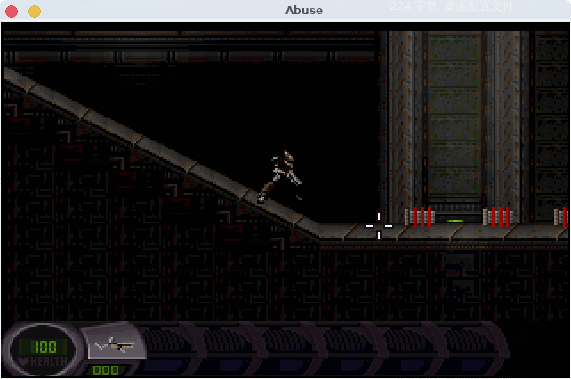

### Angband

*Angband*是一款免费的单人地下城探险游戏，您可以扮演冒险家的角色，探索深层地牢，与怪物战斗，并获得最佳武器，为与黑暗之王Morgoth的最后一场战斗做准备。这个游戏你需要进入Ctrl+Alt+F2,再来命令angband。解决中文字体冲突问题。

### Block Attack!

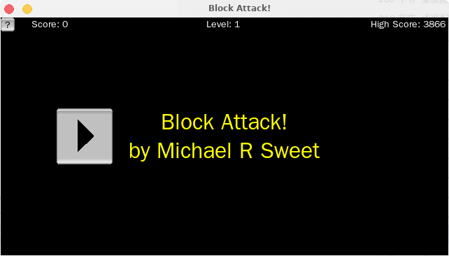

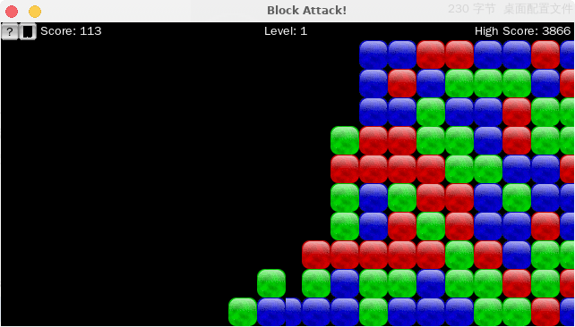

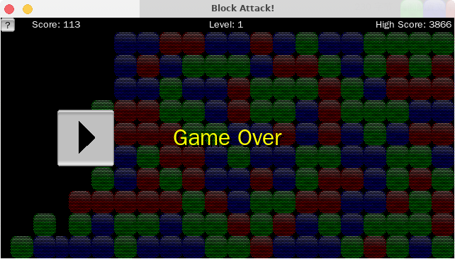

### BomberClone 炸弹人

### Dungeon Crawl Stone Soup

### Dwarf Fortress

独立 - 生存 - 地牢 -
随机地图:单人游戏幻想游戏。你在随机生成的持久世界中控制矮人前哨或冒险家。

http://www.bay12games.com/dwarves/ \|\|
[dwarffortress](https://www.archlinux.org/packages/community/x86_64/dwarffortress/)

### Gweled

### kanagram 字母顺序游戏

### NetHack

独立 - 生存 - 地牢 - 随机地图:30多年文字游戏,不知道是不是网游?(纯英文)

http://www.nethack.org/index.html \|\|
[nethack](https://www.archlinux.org/packages/community/x86_64/nethack/)

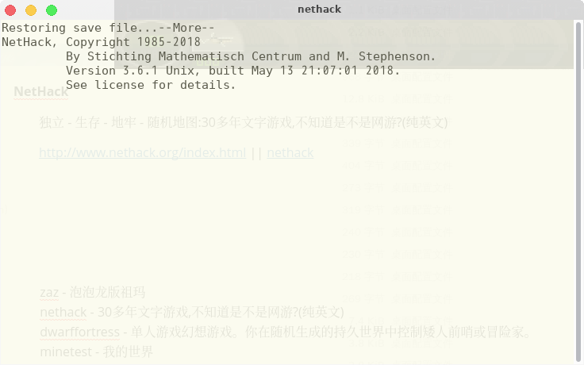

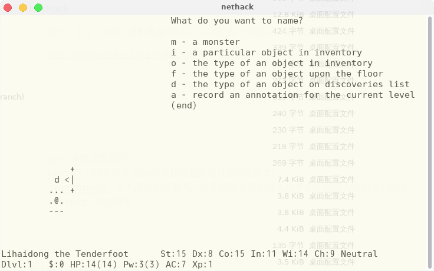

### Shattered Pixel Dungeon

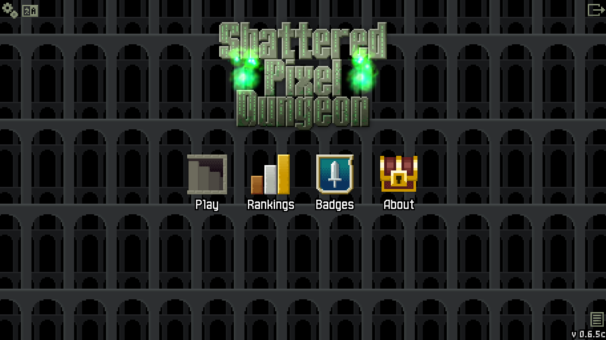

### Teeworlds

和DDNet中文游戏一样

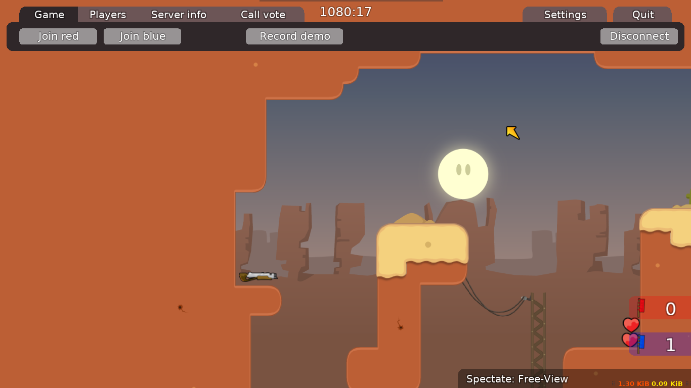

### Warsow

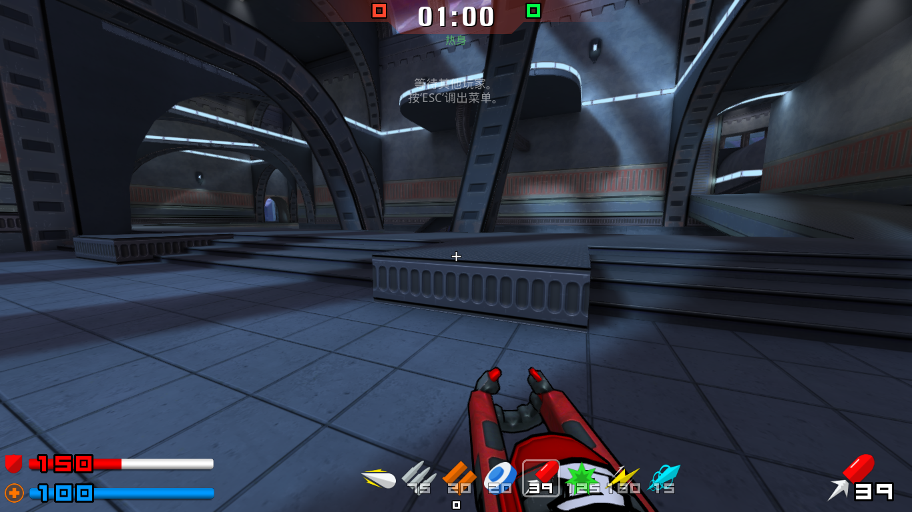

​ zaz - 泡泡龙版祖玛 dwarffortress -
单人游戏幻想游戏。你在随机生成的持久世界中控制矮人前哨或冒险家。
minetest - 我的世界

#### 未知语言游戏

counter-strike-2d - 反恐精英2D版 - 目前装不上,steam也运行不了

steam游戏平台
-------------

没有说明都是中文游戏,有的游戏需要MOD来中文化.

Terraria - 泰拉瑞亚 Don't - Starve - 饥荒单机 Don't - Starve - Together
- 饥荒联机版 Oxygen - Not - Included - 缺氧 Dungeon - Warfare - 地牢塔防
Age - of - Conquest - IV - 征服世纪4

Wine平台游戏
------------

霸王的梦想 植物大战僵尸 - (什么中文版,年度版)

Android平台游戏
---------------

没想好,毕竟大部分游戏适合触屏,不知道什么游戏才叫好游戏

MAME平台游戏
------------

kof - 拳皇系列 kov - 三国战绩系列 Metal - Slug - 合金弹头系列 西游记系列
恐龙快打二代 铁钩船长 达人王2
