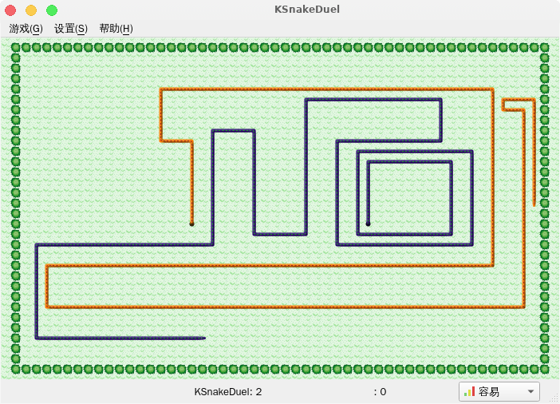
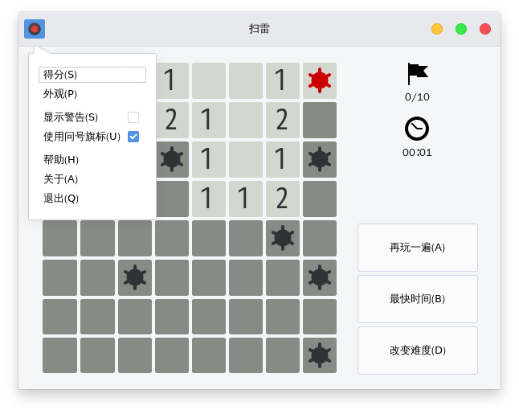
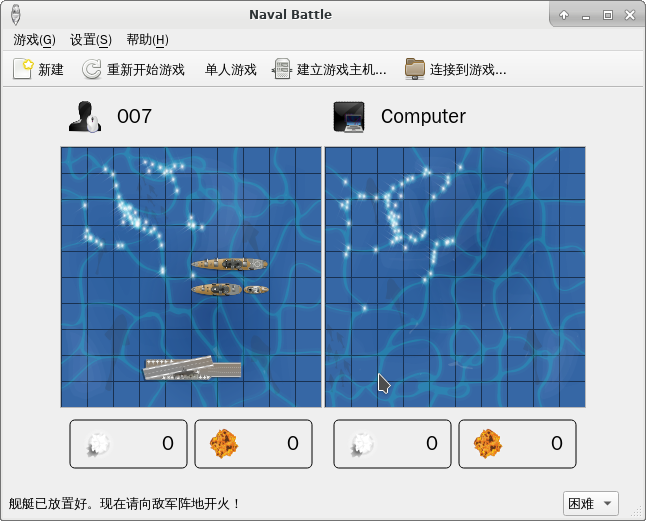
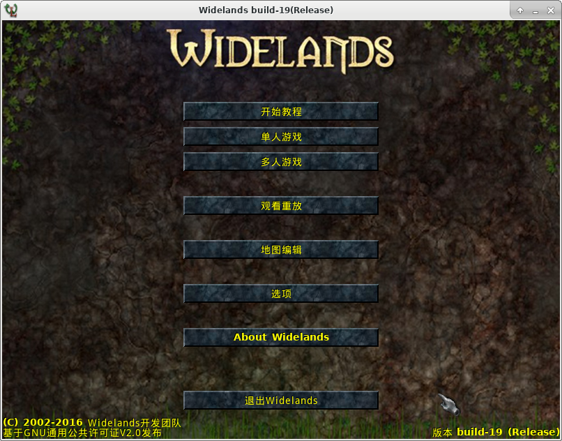
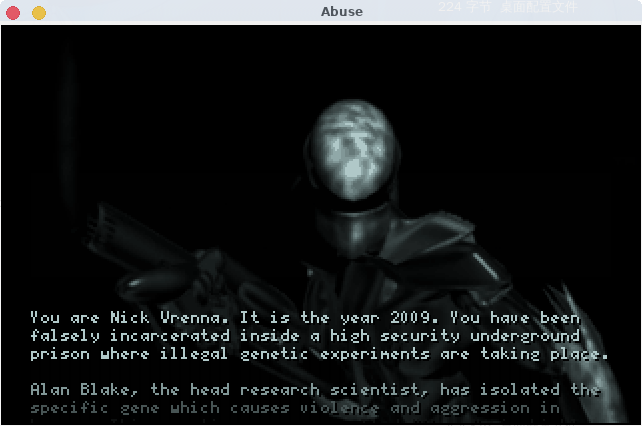
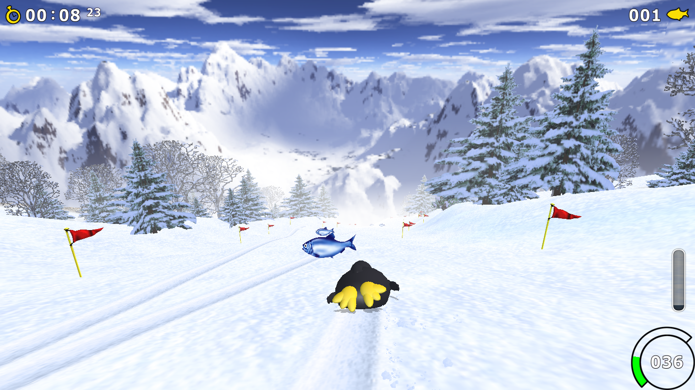

-   [ArchLinux仓库的游戏](#archlinux仓库的游戏)
    -   [中文游戏](#中文游戏)
        -   [2048](#section)
        -   [Aisleriot 纸牌游戏集合](#aisleriot-纸牌游戏集合)
        -   [Atomix 分子智力游戏](#atomix-分子智力游戏)
        -   [Bovo 五子棋](#bovo-五子棋)
        -   [Bomber 投弹者](#bomber-投弹者)
        -   [ccGo 围棋](#ccgo-围棋)
        -   [Cataclysm Dark Days Ahead
            大灾变(CDDA)](#cataclysm-dark-days-ahead-大灾变cdda)
        -   [Chess 国际象棋](#chess-国际象棋)
        -   [DDNet 土豆混战](#ddnet-土豆混战)
        -   [Five or more 连珠消球](#five-or-more-连珠消球)
        -   [Freeciv](#freeciv)
        -   [FreeCol](#freecol)
        -   [FreeDroid](#freedroid)
        -   [Frozen Bubble](#frozen-bubble)
        -   [GCompris 教育游戏](#gcompris-教育游戏)
        -   [Foobillard++ OpenGL台球游戏](#foobillard-opengl台球游戏)
        -   [Four in a Row 四子连线](#four-in-a-row-四子连线)
        -   [Gbrainy 脑筋急转弯](#gbrainy-脑筋急转弯)
        -   [Granatier 炸弹人](#granatier-炸弹人)
        -   [Hedgewars](#hedgewars)
        -   [Hitori 错误的数独](#hitori-错误的数独)
        -   [Infra Arcana](#infra-arcana)
        -   [Kajongg 麻将](#kajongg-麻将)
        -   [Klotski 华容道](#klotski-华容道)
        -   [Kapman 吃豆人](#kapman-吃豆人)
        -   [KAtomic 推箱子](#katomic-推箱子)
        -   [KBlackBox 黑箱逻辑游戏](#kblackbox-黑箱逻辑游戏)
        -   [KBlocks 俄罗斯方块](#kblocks-俄罗斯方块)
        -   [KBounce 弹球游戏](#kbounce-弹球游戏)
        -   [KBreakOut 挡板弹球游戏](#kbreakout-挡板弹球游戏)
        -   [KDiamond 三子连线棋游戏](#kdiamond-三子连线棋游戏)
        -   [KFourInLine 四子连珠游戏](#kfourinline-四子连珠游戏)
        -   [KGoldrunner
            淘金，避敌，以及解谜](#kgoldrunner-淘金避敌以及解谜)
        -   [KHangMan 吊颈人游戏](#khangman-吊颈人游戏)
        -   [Kigo 围棋](#kigo-围棋)
        -   [Killbots 机器人策略游戏](#killbots-机器人策略游戏)
        -   [Kiriki 快艇骰子](#kiriki-快艇骰子)
        -   [KJumpingCube 占领版块](#kjumpingcube-占领版块)
        -   [Klickety 消除色块游戏](#klickety-消除色块游戏)
        -   [KMahjongg 麻将连连看](#kmahjongg-麻将连连看)
        -   [KMines 扫雷](#kmines-扫雷)
        -   [kNetwalk 网络建设游戏](#knetwalk-网络建设游戏)
        -   [Knights 国际象棋](#knights-国际象棋)
        -   [Kolf 微型高尔夫](#kolf-微型高尔夫)
        -   [Kollision 坚持30秒](#kollision-坚持30秒)
        -   [Kolor Lines 连珠游戏](#kolor-lines-连珠游戏)
        -   [Konquest 星际策略](#konquest-星际策略)
        -   [KPatience 单人纸牌游戏](#kpatience-单人纸牌游戏)
        -   [KReversi 黑白棋](#kreversi-黑白棋)
        -   [KsirK 统治世界](#ksirk-统治世界)
        -   [KSnakeDuel 超空间竞速](#ksnakeduel-超空间竞速)
        -   [KSpaceDuel 空间型街机游戏](#kspaceduel-空间型街机游戏)
        -   [KSquares 方块旗力](#ksquares-方块旗力)
        -   [KSudoku 多种类数独](#ksudoku-多种类数独)
        -   [Kubrick 魔方](#kubrick-魔方)
        -   [kshisen 连连看](#kshisen-连连看)
        -   [Lagno 黑白棋](#lagno-黑白棋)
        -   [Lights Off 关灯](#lights-off-关灯)
        -   [LSkat 中尉Skat](#lskat-中尉skat)
        -   [Mahjongg 麻将对对碰](#mahjongg-麻将对对碰)
        -   [MegaGlest](#megaglest)
        -   [Mines 扫雷](#mines-扫雷)
        -   [Naval Battle](#naval-battle)
        -   [Pingus 挖地企鹅](#pingus-挖地企鹅)
        -   [Quadrapassel 俄罗斯方块](#quadrapassel-俄罗斯方块)
        -   [Robots 机器人](#robots-机器人)
        -   [SameGame](#samegame)
        -   [sudoku 数独](#sudoku-数独)
        -   [SuperTux 2](#supertux-2)
        -   [Swell Foop 消色块](#swell-foop-消色块)
        -   [Tali 掷骰子](#tali-掷骰子)
        -   [Taquin 推盘](#taquin-推盘)
        -   [Tetravex 四邻](#tetravex-四邻)
        -   [The Battle for Wesnoth
            韦诺之战](#the-battle-for-wesnoth-韦诺之战)
        -   [Nibbles 贪吃蛇](#nibbles-贪吃蛇)
        -   [Widelands](#widelands)
    -   [英文游戏](#英文游戏)
        -   [0ad](#ad)
        -   [Abuse](#abuse)
        -   [Angband](#angband)
        -   [Block Attack!](#block-attack)
        -   [BomberClone 炸弹人](#bomberclone-炸弹人)
        -   [Checkers 跳棋](#checkers-跳棋)
        -   [Dungeon Crawl Stone Soup](#dungeon-crawl-stone-soup)
        -   [Dwarf Fortress](#dwarf-fortress)
        -   [Extreme Tux Racer
            企鹅滑雪极限版](#extreme-tux-racer-企鹅滑雪极限版)
        -   [FreeDroid](#freedroid-1)
        -   [Gweled](#gweled)
        -   [kanagram 字母顺序游戏](#kanagram-字母顺序游戏)
        -   [Kcheckers 跳棋](#kcheckers-跳棋)
        -   [Mahjong　麻将](#mahjong麻将)
        -   [Minecraft 我的世界](#minecraft-我的世界)
        -   [NetHack](#nethack)
        -   [Rogue](#rogue)
        -   [Simutrans](#simutrans)
        -   [Speed Dreams](#speed-dreams)
        -   [SuperTuxKart](#supertuxkart)
        -   [Shattered Pixel Dungeon
            破碎的地牢](#shattered-pixel-dungeon-破碎的地牢)
        -   [Teeworlds](#teeworlds)
        -   [ToME4](#tome4)
        -   [Warsow](#warsow)
        -   [Xmoto](#xmoto)
        -   [Zaz](#zaz)
    -   [未知语言游戏（目前想玩的）](#未知语言游戏目前想玩的)
        -   [测试分割线，下面有空再修正](#测试分割线下面有空再修正)
    -   [steam游戏平台](#steam游戏平台)
    -   [Wine平台游戏](#wine平台游戏)
    -   [Android平台游戏](#android平台游戏)
    -   [MAME平台游戏](#mame平台游戏)

ArchLinux仓库的游戏
===================

不分官方和aur系列,你可以试试pacman或者aur工具,优先试试pacman工具能不能下载

中文游戏
--------

### 2048

益智 - 休闲:2048之后还有什么?是4096?还是?

https://wiki.gnome.org/Apps/2048\|\|
[gnome-2048](https://www.archlinux.org/packages/extra/x86_64/gnome-2048/)

https://github.com/mevdschee/2048.c \|\|
[2048.c-git](https://aur.archlinux.org/packages/2048.c-git/)AUR

### Aisleriot 纸牌游戏集合

益智 - 休闲 -
纸牌:Aisleriot也称为Solitaire或sol,看看空当接龙玩法就知道了。

https://wiki.gnome.org/Apps/Aisleriot \|\|
[aisleriot](https://www.archlinux.org/packages/extra/x86_64/aisleriot/)

### Atomix 分子智力游戏

原子和分子的智力游戏。

https://wiki.gnome.org/Apps/Atomix \|\|
[atomix](https://www.archlinux.org/packages/extra/x86_64/atomix/)

### Bovo 五子棋

五子连珠，一定胜负。

https://kde.org/applications/games/bovo/ \|\|
[bovo](https://www.archlinux.org/packages/extra/x86_64/bovo/)

### Bomber 投弹者

街机上的投弹游戏

https://www.kde.org/applications/games/bomber/ \|\| [bomber](https://www.archlinux.org/packages/extra/x86_64/bomber/)

### ccGo 围棋

规则简单，下子复杂。

http://ccdw.org/\~cjj/prog/ccgo/ \|\|
[ccgo](https://www.archlinux.org/packages/community/x86_64/ccgo/)

### Cataclysm Dark Days Ahead 大灾变(CDDA)

独立 - 生存 - 地牢 - 随机地图:这是一个生化危机版生存游戏。

http://en.cataclysmdda.com/ \|\|
[cataclysm-dda](https://www.archlinux.org/packages/community/x86_64/cataclysm-dda/)
\|\|
[cataclysm-dda-ncurses](https://aur.archlinux.org/packages/cataclysm-dda-ncurses/)AUR
\|\|
[cataclysm-dda-tiles](https://aur.archlinux.org/packages/cataclysm-dda-tiles/)AUR

### Chess 国际象棋

2D国际象棋游戏

https://wiki.gnome.org/Apps/Chess \|\|
[gnome-chess](https://www.archlinux.org/packages/extra/x86_64/gnome-chess/)

### DDNet 土豆混战

多用户 - 快节奏:Teeworlds的修改版,快节奏横向卷轴多人动作射击游戏。

https://ddnet.tw/ \|\| [ddnet](https://aur.archlinux.org/packages/ddnet/)AUR

### Five or more 连珠消球

将彩球连成一线以消除

https://wiki.gnome.org/Apps/Five%20or%20more \|\|
[five-or-more](https://www.archlinux.org/packages/extra/x86_64/five-or-more/)

### Freeciv

多用户 - 回合制 - 策略游戏:灵感来自Microprose文明帝国。

http://freeciv.wikia.com/wiki/Main\_Page \|\|
[freeciv](https://www.archlinux.org/packages/extra/x86_64/freeciv/)

### FreeCol

多用户 - 回合制 - 策略游戏:基于殖民化的基于回合的策略游戏。

http://www.freecol.org/ \|\|
[freecol](https://www.archlinux.org/packages/community/any/freecol/)

### FreeDroid

Commodore
64上经典游戏'Paradroid'的克隆版，通过摧毁它们或通过迷你游戏将它们带走来清除敌方机器人的太空船队。

http://freedroid.sourceforge.net/ \|\|
[freedroid](https://www.archlinux.org/packages/community/x86_64/freedroid/)

### Frozen Bubble

### GCompris 教育游戏

为 2 到 10 岁儿童准备的多功能教育游戏

http://gcompris.net/ \|\|
[gcompris-qt](https://www.archlinux.org/packages/community/x86_64/gcompris-qt/)

### Foobillard++ OpenGL台球游戏

OpenGL台球游戏

http://foobillardplus.sourceforge.net/ \|\|
[foobillard++](https://www.archlinux.org/packages/extra/x86_64/foobillard++/)

### Four in a Row 四子连线

将四粒棋子排成一线以取胜

https://wiki.gnome.org/Apps/Four-in-a-row \|\|
[four-in-a-row](https://www.archlinux.org/packages/extra/x86_64/four-in-a-row/)

### Gbrainy 脑筋急转弯

玩那些可以挑战您的逻辑、语言能力、计算和记忆的游戏

https://wiki.gnome.org/Apps/gbrainy \|\|
[gbrainy](https://www.archlinux.org/packages/community/any/gbrainy/)

### Granatier 炸弹人

经典炸弹人游戏的克隆

https://kde.org/applications/games/granatier/ \|\|
[granatier](https://www.archlinux.org/packages/extra/x86_64/granatier/)

### Hedgewars

基于回合制的战略炮兵游戏类似于蠕虫。刚刚开始我还以为是那个童话故事。

https://hedgewars.org/ \|\|
[hedgewars](https://www.archlinux.org/packages/community/x86_64/hedgewars/)

### Hitori 错误的数独

类似错的数独游戏开局，要求清除多余冲突数字

https://wiki.gnome.org/Apps/Hitori \|\|
[hitori](https://www.archlinux.org/packages/extra/x86_64/hitori/)

### Infra Arcana

Roguelike游戏灵感来自HP Lovecraft。

https://sites.google.com/site/infraarcana/home \|\|
[infra-arcana](https://aur.archlinux.org/packages/infra-arcana/)AUR

https://gitlab.com/martin-tornqvist/ia \|\|
[infra-arcana-git](https://aur.archlinux.org/packages/infra-arcana-git/)AUR

### Kajongg 麻将

中国传统的四人桌上游戏

https://kde.org/applications/games/kajongg/ \|\|
[kajongg](https://www.archlinux.org/packages/extra/any/kajongg/)

### Klotski 华容道

益智 - 休闲:前前后后左右皆是追兵,曹操走得了吗?灵感来自曹操退走华容道。

https://wiki.gnome.org/Apps/Klotski \|\|
[gnome-klotski](https://www.archlinux.org/packages/extra/x86_64/gnome-klotski/)

### Kapman 吃豆人

逃脱精灵吃豆子

https://kde.org/applications/games/kapman/ \|\|
[kapman](https://www.archlinux.org/packages/extra/x86_64/kapman/)

### KAtomic 推箱子

类似推箱子的逻辑游戏

https://kde.org/applications/games/kapman/ \|\|
[kapman](https://www.archlinux.org/packages/extra/x86_64/kapman/)

### KBlackBox 黑箱逻辑游戏

找出所有球隐匿的位置。

https://kde.org/applications/games/kblackbox/ \|\|
[kblackbox](https://www.archlinux.org/packages/extra/x86_64/kblackbox/)

### KBlocks 俄罗斯方块

俄罗斯方块游戏

https://kde.org/applications/games/kblocks/ \|\|
[kblocks](https://www.archlinux.org/packages/extra/x86_64/kblocks/)

### KBounce 弹球游戏

知道街机游戏天蚕变吗？

https://kde.org/applications/games/kbounce/ \|\|
[kbounce](https://www.archlinux.org/packages/extra/x86_64/kbounce/)

### KBreakOut 挡板弹球游戏

街机版和红白机版弹球游戏，都玩过了。

https://kde.org/applications/games/kbreakout/ \|\|
[kbreakout](https://www.archlinux.org/packages/extra/x86_64/kbreakout/)

### KDiamond 三子连线棋游戏

三子连线棋游戏

https://kde.org/applications/games/kdiamond/ \|\|
[kdiamond](https://www.archlinux.org/packages/extra/x86_64/kdiamond/)

### KFourInLine 四子连珠游戏

四子连珠游戏

https://kde.org/applications/games/kfourinline/ \|\|
[kfourinline](https://www.archlinux.org/packages/extra/x86_64/kfourinline/)

### KGoldrunner 淘金，避敌，以及解谜

动作和解谜游戏

https://kde.org/applications/games/kgoldrunner/ \|\|
[kgoldrunner](https://www.archlinux.org/packages/extra/x86_64/kgoldrunner/)

### KHangMan 吊颈人游戏

**KHangMan**是一款基于着名的刽子手游戏的游戏。它针对六岁及以上的儿童。游戏中有几类词语可供使用，例如：动物（动物词）和三种难度类别：简单，中等和难度。随机挑选一个单词，隐藏字母，你必须通过尝试一个接一个的字母来猜测单词。每当你猜错了一个字母，就会画一部刽子手的照片。在被绞死之前你必须猜出这个词！你有10次尝试。

https://kde.org/applications/education/khangman/ \|\|
[khangman](https://www.archlinux.org/packages/extra/x86_64/khangman/)

### Kigo 围棋

围棋游戏

https://kde.org/applications/games/kigo/ \|\|
[kigo](https://www.archlinux.org/packages/extra/x86_64/kigo/)

### Killbots 机器人策略游戏

回避杀手机器人的简单游戏，参考神经猫。

https://kde.org/applications/games/killbots/ \|\|
[killbots](https://www.archlinux.org/packages/extra/x86_64/killbots/)

### Kiriki 快艇骰子

快艇骰子游戏

https://kde.org/applications/games/kiriki/ \|\|
[kiriki](https://www.archlinux.org/packages/extra/x86_64/kiriki/)

### KJumpingCube 占领版块

版块占领战术游戏。

https://kde.org/applications/games/kjumpingcube/ \|\|
[kjumpingcube](https://www.archlinux.org/packages/extra/x86_64/kjumpingcube/)

### Klickety 消除色块游戏

Clickomania游戏的改编

https://kde.org/applications/games/klickety/ \|\|
[klickety](https://www.archlinux.org/packages/extra/x86_64/klickety/)

### KMahjongg 麻将连连看

麻将连连看游戏

https://kde.org/applications/games/kmahjongg/ \|\|
[kmahjongg](https://www.archlinux.org/packages/extra/x86_64/kmahjongg/)

### KMines 扫雷

扫雷游戏,相对于Win7来说，不智能。

https://kde.org/applications/games/kmines/ \|\|
[kmines](https://www.archlinux.org/packages/extra/x86_64/kmines/)

### kNetwalk 网络建设游戏

类似管道维修的游戏

https://kde.org/applications/games/knetwalk/ \|\|
[knetwalk](https://www.archlinux.org/packages/extra/x86_64/knetwalk/)

### Knights 国际象棋

国际象棋游戏

https://www.kde.org/applications/games/knights/ \|\|
[knights](https://www.archlinux.org/packages/community/x86_64/knights/)

### Kolf 微型高尔夫

一个微型高尔夫游戏，2d自上而下的视图。

https://kde.org/applications/games/kolf/ \|\|
[kolf](https://www.archlinux.org/packages/extra/x86_64/kolf/)

### Kollision 坚持30秒

讲个笑话，是男人，坚持３０秒。

https://kde.org/applications/games/kollision/ \|\|
[kollision](https://www.archlinux.org/packages/extra/x86_64/kollision/)

### Kolor Lines 连珠游戏

类似连珠游戏

https://kde.org/applications/games/klines/ \|\|
[klines](https://www.archlinux.org/packages/extra/x86_64/klines/)

### Konquest 星际策略

星际策略游戏

https://kde.org/applications/games/konquest/ \|\|
[konquest](https://www.archlinux.org/packages/extra/x86_64/konquest/)

### KPatience 单人纸牌游戏

提供各种单人纸牌游戏

https://kde.org/applications/games/kpatience/ \|\|
[kpatience](https://www.archlinux.org/packages/extra/x86_64/kpatience/)

### KReversi 黑白棋

黑白棋棋盘游戏

https://kde.org/applications/games/kreversi/ \|\|
[kreversi](https://www.archlinux.org/packages/extra/x86_64/kreversi/)

### KsirK 统治世界

世界统治战略游戏

https://kde.org/applications/games/ksirk/ \|\|
[ksirk](https://www.archlinux.org/packages/extra/x86_64/ksirk/)

### KSnakeDuel 超空间竞速

一场简单的蛇决斗比赛

https://kde.org/applications/games/ksnakeduel/ \|\|
[ksnakeduel](https://www.archlinux.org/packages/extra/x86_64/ksnakeduel/)

### KSpaceDuel 空间型街机游戏

两个可能的玩家中的每一个控制围绕太阳运行的卫星太空船

https://kde.org/applications/games/kspaceduel/ \|\|
[kspaceduel](https://www.archlinux.org/packages/extra/x86_64/kspaceduel/)

### KSquares 方块旗力

通过点连接创建方形

https://kde.org/applications/games/ksquares/ \|\|
[ksquares](https://www.archlinux.org/packages/extra/x86_64/ksquares/)

### KSudoku 多种类数独

多种类数独游戏

https://kde.org/applications/games/ksudoku/ \|\|
[ksudoku](https://www.archlinux.org/packages/extra/x86_64/ksudoku/)

### Kubrick 魔方

不错的魔方游戏，解不了的，可以用电脑自动解决。可以载入存档。

https://kde.org/applications/games/kubrick/ \|\|
[kubrick](https://www.archlinux.org/packages/extra/x86_64/kubrick/)

### kshisen 连连看

类似连连看的麻将游戏

https://kde.org/applications/games/kshisen/ \|\|
[kshisen](https://www.archlinux.org/packages/extra/x86_64/kshisen/)

### Lagno 黑白棋

Iagno是一款类似于Go的双人战略游戏。

https://wiki.gnome.org/Apps/Iagno \|\|
[Iagno](https://www.archlinux.org/packages/extra/x86_64/iagno/)

### Lights Off 关灯

Lights
Off是一款益智游戏，其目标是关闭棋盘上的所有棋子。每次单击都会切换单击的图块及其非对角线邻居的状态。

https://wiki.gnome.org/Apps/Lightsoff \|\|
[lightsoff](https://www.archlinux.org/packages/extra/x86_64/lightsoff/)

### LSkat 中尉Skat

中尉Skat是一款适合两名玩家的有趣且引人入胜的纸牌游戏。

https://kde.org/applications/games/lskat/ \|\|
[lskat](https://www.archlinux.org/packages/extra/x86_64/lskat/)

### Mahjongg 麻将对对碰

经典东方瓷砖游戏Mahjongg的单人纸牌（单人游戏）版本。目标是选择相似的瓷砖对。

https://wiki.gnome.org/Apps/Mahjongg \|\|
[gnome-mahjongg](https://www.archlinux.org/packages/extra/x86_64/gnome-mahjongg/)

### MegaGlest

Fork of Glest，一个梦幻世界中的3D即时战略游戏。（需要手动设置中文）

https://megaglest.org \|\|
[megaglest](https://www.archlinux.org/packages/community/x86_64/megaglest/)

### Mines 扫雷

扫除雷区里的隐藏的地雷

https://kde.org/applications/games/kmines/ \|\|
[kmines](https://www.archlinux.org/packages/extra/x86_64/kmines/)

### Naval Battle

一艘沉没的游戏。

https://kde.org/applications/games/knavalbattle/ \|\|
[knavalbattle](https://www.archlinux.org/packages/extra/x86_64/knavalbattle/)

### Pingus 挖地企鹅

Lemmings克隆，即基于关卡的益智游戏。

http://pingus.seul.org/ \|\|
[pingus](https://www.archlinux.org/packages/community/x86_64/pingus/)

### Quadrapassel 俄罗斯方块

益智 - 休闲:将下落的方块组合在一起。

https://wiki.gnome.org/Apps/Quadrapassel \|\|
[quadrapassel](https://www.archlinux.org/packages/extra/x86_64/quadrapassel/)

### Robots 机器人

经典的机器人游戏，你必须避免一堆试图杀死你的机器人。你采取的每一步都会让他们更接近你。幸运的是，他们不是很聪明，你也有一个有用的远程传送小工具。

https://wiki.gnome.org/Apps/Robots \|\|
[gnome-robots](https://www.archlinux.org/packages/extra/x86_64/gnome-robots/)

### SameGame

色块消去游戏

https://kde.org/applications/games/klickety/ \|\|
[klickety](https://www.archlinux.org/packages/extra/x86_64/klickety/)

### sudoku 数独

通过这个数字格子解谜游戏测试您的逻辑能力

https://wiki.gnome.org/Apps/Sudoku \|\|
[gnome-sudoku](https://www.archlinux.org/packages/extra/x86_64/gnome-sudoku/)

### SuperTux 2

一款经典的2D jump'n'run sidescroller游戏，风格类似于原版SuperMario游戏

https://github.com/supertux/supertux \|\|
[supertux](https://www.archlinux.org/packages/community/x86_64/simutrans/)

### Swell Foop 消色块

尽可能少地移动对象。彼此相邻的类似对象作为一组被移除。

https://wiki.gnome.org/Apps/Swell%20Foop \|\|
[swell-foop](https://www.archlinux.org/packages/extra/x86_64/swell-foop/)

### Tali 掷骰子

一种类似扑克的的骰子游戏

https://wiki.gnome.org/Apps/Tali \|\|
[tall](https://www.archlinux.org/packages/extra/x86_64/tali/)

### Taquin 推盘

将方块滑动到正确位置

https://wiki.gnome.org/Apps/Taquin \|\|
[gnome-taquin](https://www.archlinux.org/packages/extra/x86_64/gnome-taquin/)

### Tetravex 四邻

匹配编号的方块来完成谜题

https://wiki.gnome.org/Apps/Tetravex \|\|
[gnome-tetravex](https://www.archlinux.org/packages/extra/x86_64/gnome-tetravex/)

### The Battle for Wesnoth 韦诺之战

多用户 - 回合制 -
策略游戏:免费的基于回合的战术策略游戏，具有高度的幻想主题，包括单人游戏和在线/多人游戏多人战斗。

https://www.wesnoth.org/ \|\| [wesnoth](https://www.archlinux.org/packages/community/x86_64/wesnoth/)

### Nibbles 贪吃蛇

休闲 - 多人: 小蛇游走于迷宫

https://wiki.gnome.org/Apps/Nibbles \|\|
[gnome-nibbles](https://www.archlinux.org/packages/extra/x86_64/gnome-nibbles/)

### Widelands

一个实时战略游戏，重点是经济和运输。

http://widelands.org/ \|\|
[widelands](https://www.archlinux.org/packages/community/x86_64/widelands/)

英文游戏
--------

### 0ad

多用户 - 回合制 -
策略游戏:类似于《帝国时代》的策略类3D游戏,需要自己下载中文语言包。有没有发现和魔兽争霸差不多？

http://play0ad.com/ \|\|
[0ad](https://www.archlinux.org/packages/community/x86_64/0ad/)

### Abuse

横版射击 - 角色 - 多人联机:侧滚动动作游戏，让你对抗无情的外星杀手。

http://abuse.zoy.org/ \|\|
[abuse](https://www.archlinux.org/packages/community/x86_64/abuse/)

### Angband

*Angband*是一款免费的单人地下城探险游戏，您可以扮演冒险家的角色，探索深层地牢，与怪物战斗，并获得最佳武器，为与黑暗之王Morgoth的最后一场战斗做准备。这个游戏你需要进入Ctrl+Alt+F2,再来命令angband。解决中文字体冲突问题。

http://rephial.org/ \|\|
[angband](https://www.archlinux.org/packages/community/x86_64/angband/)

无法截图，无法运行。需要纯英文前端（终端），看起来应该是字体问题。而且来自官方仓库里的，应该不会出现运行ｂｕｇ。但是懒得改用中文字体。

### Block Attack!

找不到哪里的包，这个游戏不错

http://www.fltk.org/ \|\|
[fltk-games](https://www.archlinux.org/packages/community/x86_64/fltk-games/)

### BomberClone 炸弹人

克隆的原子炸弹人游戏

http://www.bomberclone.de/ \|\|
[bomberclone](https://www.archlinux.org/packages/community/x86_64/bomberclone/)

### Checkers 跳棋

伴随FLTK的示例游戏：块，跳棋和数独游戏

http://www.fltk.org/ \|\|
fltk-[games](https://www.archlinux.org/packages/community/x86_64/fltk-games/)

### Dungeon Crawl Stone Soup

通过充满危险怪物的地下城进行的roguelike探险，以寻找神秘的Zot Orb。

https://crawl.develz.org/ \|\|
[crawl-tiles](https://aur.archlinux.org/packages/crawl-tiles/)AUR

### Dwarf Fortress

独立 - 生存 - 地牢 -
随机地图:一个单人幻想游戏，你可以在这个游戏中建立一个矮人前哨或在随机生成的世界中扮演一个冒险家。这个游戏有很多不同版本的图形前端。

http://www.bay12games.com/dwarves/ \|\|
[dwarffortress](https://www.archlinux.org/packages/community/x86_64/dwarffortress/)

http://www.dwarffortresswiki.org/index.php/DF2014:Installation\#Download
\|\|
[dwarffortress-ironhand](https://aur.archlinux.org/packages/dwarffortress-ironhand/)AUR
\|\|
[dwarffortress-phoebus](https://aur.archlinux.org/packages/dwarffortress-phoebus/)AUR

### Extreme Tux Racer 企鹅滑雪极限版

谁说企鹅不会飞？冬天来临，冰雪开始慢慢地封住山峦。你想知道山坡雪地下滑的速度极限？还是想体验惊险刺激？

http://sourceforge.net/projects/extremetuxracer/ \|\|
[extremetuxracer](https://www.archlinux.org/packages/community/x86_64/extremetuxracer/)

### FreeDroid

Commodore
64上经典游戏'Paradroid'的克隆版，通过摧毁它们或通过迷你游戏将它们带走来清除敌方机器人的太空船队。

http://freedroid.sourceforge.net/ \|\|
[freedroid](https://www.archlinux.org/packages/community/x86_64/freedroid/)

### Gweled

类似于宝石迷阵（又名钻石矿）的益智游戏。

https://launchpad.net/gweled/ \|\|
[gweled](https://www.archlinux.org/packages/extra/x86_64/gweled/)

### kanagram 字母顺序游戏

信件订购游戏

https://kde.org/applications/education/kanagram/ \|\|
[kanagram](https://www.archlinux.org/packages/extra/x86_64/kanagram/)

### Kcheckers 跳棋

基于Qt4的跳棋棋盘游戏

http://qcheckers.sourceforge.net/ \|\|
[kcheckers](https://www.archlinux.org/packages/community/x86_64/kcheckers/)

### Mahjong　麻将

具有网络支持的Mah Jong经典游戏（不是solitare版本）。

http://mahjong.julianbradfield.org/ \|\|
[mahjong](https://www.archlinux.org/packages/community/x86_64/mahjong/)

### Minecraft 我的世界

一个开放世界的游戏，其游戏玩法围绕打破和放置块。

http://www.minecraft.net/ \|\|
[minecraft](https://aur.archlinux.org/packages/minecraft/)

### NetHack

独立 - 生存 - 地牢 - 随机地图:30多年文字游戏,不知道是不是网游?(纯英文)

http://www.nethack.org/index.html \|\|
[nethack](https://www.archlinux.org/packages/community/x86_64/nethack/)

### Rogue

原始的地下城爬行游戏。没有图形界面，终端rogue运行。

http://www.roguebasin.com/index.php?title=Rogue \|\|
[rogue](https://www.archlinux.org/packages/community/x86_64/rogue/)

### Simutrans

一个开源运输模拟游戏。

https://www.simutrans.com/ \|\|
[simutrans](https://www.archlinux.org/packages/community/x86_64/simutrans/)
\|\|
[simutrans-pak128](https://www.archlinux.org/packages/community/any/simutrans-pak128/)

### Speed Dreams

具有丰富图形和物理特性的赛车模拟器。

http://speed-dreams.sourceforge.net/ \|\|
[speed-dreams](https://www.archlinux.org/packages/community/x86_64/speed-dreams/)

### SuperTuxKart

卡特赛车游戏以Tux和他的朋友为特色。

http://supertuxkart.sourceforge.net/ \|\|
[supertuxkart](https://www.archlinux.org/packages/community/x86_64/supertuxkart/)

### Shattered Pixel Dungeon 破碎的地牢

像素版地牢游戏。

http://shatteredpixel.tumblr.com/ \|\|
[shattered-pixel-dungeon](https://aur.archlinux.org/packages/shattered-pixel-dungeon/)AUR
\|\|
[shattered-pixel-dungeon-git](https://aur.archlinux.org/packages/shattered-pixel-dungeon-git/)AUR

### Teeworlds

快节奏的多人2D射击游戏。

https://www.teeworlds.com/ \|\|
[teeworlds](https://www.archlinux.org/packages/community/x86_64/teeworlds/)

### ToME4

一个开源的，单人游戏，角色扮演类游戏，在EAYL的世界。

http://tome.te4.org/ \|\|
[tome4](https://aur.archlinux.org/packages/tome4/)AUR \|\|
[tome4-beta](https://aur.archlinux.org/packages/tome4-beta/)AUR \|\|
[tome4-git](https://aur.archlinux.org/packages/tome4-git/)AUR

### Warsow

基于Qfusion引擎的免费在线多人竞争FPS

https://www.warsow.gg/ \|\|
[warsow](https://www.archlinux.org/packages/community/x86_64/warsow/)

### Xmoto

具有挑战性的2D越野摩托车平台游戏，其中物理起着重要作用。

http://xmoto.tuxfamily.org/ \|\|
[xmoto](https://www.archlinux.org/packages/community/x86_64/xmoto/)

### Zaz

操作风格类似泡泡龙版祖玛

http://sourceforge.net/projects/zaz/ \|\|
[zaz](https://www.archlinux.org/packages/community/x86_64/zaz/)

未知语言游戏（目前想玩的）
--------------------------

counter-strike-2d - 反恐精英2D版 - 目前装不上,steam也运行不了

------------------------------------------------------------------------

###### 测试分割线，下面有空再修正

------------------------------------------------------------------------

steam游戏平台
-------------

没有说明都是中文游戏,有的游戏需要MOD来中文化.毫不夸张的说！前100的支持中文的Linux游戏．几乎可以收藏。纯网游不算。

Terraria - 泰拉瑞亚 Don't - Starve - 饥荒单机 Don't - Starve - Together
- 饥荒联机版 Oxygen - Not - Included - 缺氧 Dungeon - Warfare - 地牢塔防
Age - of - Conquest - IV - 征服世纪4

Wine平台游戏
------------

霸王的梦想 植物大战僵尸 - (什么中文版,年度版)

Android平台游戏
---------------

没想好,毕竟大部分游戏适合触屏,不知道什么游戏才叫好游戏

MAME平台游戏
------------

kof - 拳皇系列 kov - 三国战绩系列 Metal - Slug - 合金弹头系列 西游记系列
恐龙快打二代 铁钩船长 达人王2
